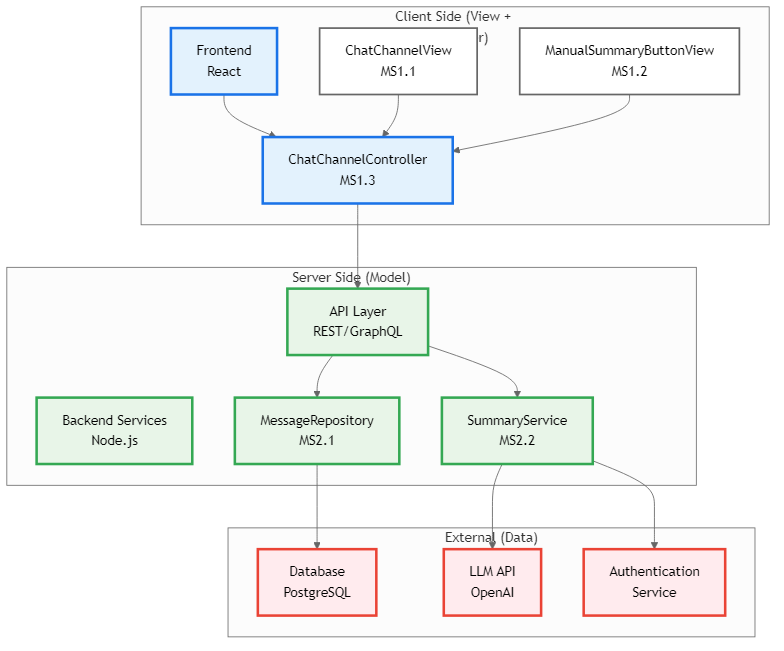
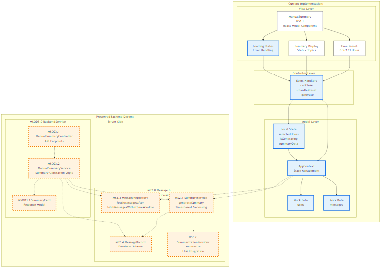
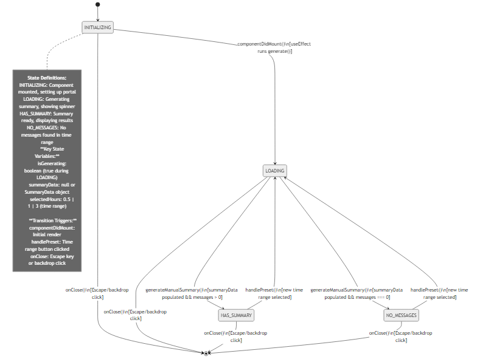
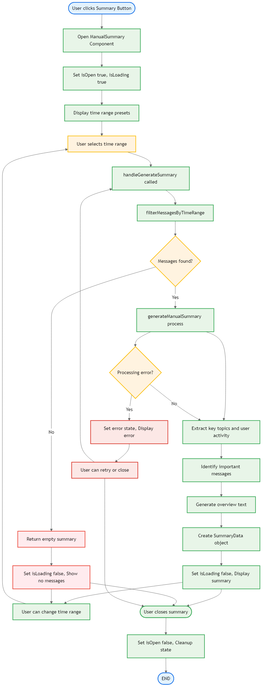

# Dev Specification Document
**Project:** Web‑Based Discord Clone with Enhanced Usability Features  
**Feature:** Manual Summary on Demand
**Version:** v2.0

## 1. Document Version History

| Version | Date | Editor | Summary of Changes |
| :--- | :--- | :--- | :--- |
| 0.1 | 2026-02-13 | Nafisa Ahmed | Initial document creation for Manual Summary On Demand user story |
| 0.2 | 2026-02-13 | Elvis Valcarcel | Adjusted for consistency across devspecs |
| 2.0 | 2026-03-03 | Salma Ghazi | Updated diagrams to match actual codebase, optimized content, removed fluff |

### Authors & Contributors
| Name | Role / Responsibility | Contributed Versions |
| :--- | :--- | :--- |
| Nafisa Ahmed | Product Owner | v0.1 |
| Elvis Valcarcel | Editor | v0.2 |
| Salma Ghazi | Technical Update | v2.0 |

## 2. Architecture Diagram

### Deployment and Where Components Run

| Component | Runtime Location | Rationale |
| :-------- | :---------------- | :-------- |
| **MS1.0 Manual Summary Modal** (MS1.1 ManualSummary) | **Client** (browser) | Single React component handles modal display, time presets, summary generation, and user interactions. Uses AppContext for data and local state for UI management. |
| **MS2.0 Message & Summarization Module** (MS2.1 MessageRepository, MS2.2 SummaryService, MS2.3 SummarizationProvider) | **Server** | Backend services for message retrieval, summarization, and LLM integration. Currently mocked client-side, will be implemented server-side in backend sprint. |

**Current Implementation Flow:** User clicks time preset → ManualSummary component processes messages locally → Displays summary in modal using mock data.

**Future Backend Flow:** User clicks time preset → ManualSummary calls backend API → MessageRepository fetches messages → SummaryService generates summary → Response displays in modal.

**Shared with What You Missed (WYMS):** The MS2.0 Message & Summarization Module is shared with the "What You Missed" preview feature. The WYMS dev spec (`automatic_summary_feature_dev_spec.md`) defines an expanded shared module (SummaryService, SummarizationProvider, MessageRepository, MembershipService) that both features use. When integrating both features, the WYMS spec's expanded MS2.0 definition should be adopted; MessageRepository, SummaryService, and related components are reused by WYMS for preview generation. **MessageRepository API alignment:** Manual (MS2.1) and Automatic (MS2.3) share the same interface: `fetchMessagesAfter`, `fetchMessagesWithinTimeWindow`, `getLastReadMessageIdentifier`, and `setLastReadMessageIdentifier`; WYMS may use a dedicated LastReadRepository that wraps or parallels the last-read methods.

### Rationale and Justification:
This architecture uses a MVC pattern to make sure that the application stays responsive while the data is processing. It separates the database entities such as MessageRecord from the objects such as SummaryViewModel to keep the backend schema intact and also minimize the amount of the data sent to the client browser. Likewise, the backend is not burdened with hosting the model that actually summarizes the conversations, instead, the server will host the logic necessary for storing and filtering data before utilizing external API calls to an LLM like OpenAI. This reduces complexity of the overall project as the alternative, implementing a custom trained NLP model, is an enormous time sink (though may be interesting to explore in the future). Essentially, doing it this way frees up dev/computing resources for other features/refinements.

## 3. Class Diagrams

**Actual Implementation (Client-Side Modal with Mock Data):**

**Class: MS1.1 ManualSummary**
* **Props Interface**: `ManualSummaryProps` (lines 7-10)
  - `messages: Message[]` - Array of messages to summarize from AppContext
  - `onClose: () => void` - Callback to close modal dialog
* **Local State**:
  - `selectedHours: number` - Time range selection (0.5, 1, 3 hours) (line 120)
  - `isGenerating: boolean` - Loading state during generation (line 121)
  - `summaryData: SummaryData | null` - Generated summary results (line 122)
  - `announcement: string` - Status messages for accessibility (line 123)
* **Global State**: `users: User[]` from AppContext via `useApp()` hook (line 3)
* **Key Functions**:
  - `generateManualSummary(messages, users, startDate, endDate)` - Client-side summary generation (line 36)
  - `handlePreset(hours)` - Time preset selection handler (line 215)
  - `generate(hours)` - Orchestrates summary generation with timeout (line 196)
  - `handleKeyDown(e)` - Keyboard navigation for accessibility (line 175)

**Current Implementation Architecture:**
The ManualSummary component is a **single React component** that implements both View and Controller responsibilities:
- **View Layer**: Renders modal dialog with time presets, loading states, summary results, and statistics
- **Controller Layer**: Handles time range selection, summary generation, modal close, and keyboard navigation
- **Model Layer**: Uses AppContext for global state (`users`, `messages`) and local state for UI management

**Backend Design (Preserved for Future Server Implementation):**

**MS2.1 MessageRepository**
* **Current Implementation**: Messages passed as props from parent component (client-side mock)
* **Future Backend**: Server-side data access with `fetchMessagesAfter()`, `fetchMessagesWithinTimeWindow()`, `getLastReadMessageIdentifier()`, and `setLastReadMessageIdentifier()` methods
* **Purpose**: Server-side message retrieval and time-based filtering for manual summaries

**MS2.2 SummaryService**
* **Current Implementation**: `generateManualSummary()` function - client-side mock with hardcoded channel summaries
* **Future Backend**: Server-side service with `generateSummary(messages)` method coordinating with SummarizationProvider
* **Purpose**: Server-side orchestration of message analysis and summary generation

**MS2.3 SummarizationProvider**
* **Current Implementation**: Hardcoded summaries in `generateManualSummary()` for specific channels/DMs (lines 90-118)
* **Future Backend**: LLM integration service with `summarize(messageTexts)` method
* **Purpose**: Production-ready AI summarization via external API (OpenAI, etc.)

**Data Structures:**

**SummaryData Interface** (lines 12-24)
* `overview: string` - Generated summary overview
* `keyTopics: string[]` - Extracted key topics
* `mostActiveUsers: { username: string; count: number }[]` - Active user statistics
* `importantMessages: Message[]` - Important messages identified
* `timeframe: string` - Summary time period
* `stats: { totalMessages, uniqueUsers, questionsAsked, decisionsMarked }` - Summary statistics

### Rationale and Justification:
The actual implementation uses a pragmatic single-component approach that handles all MVC responsibilities internally. The ManualSummary component manages its own state, processes data with the `generateManualSummary` function, and provides a complete modal interface. This approach provides a self-contained, efficient implementation that aligns with the current codebase structure while maintaining clear separation of concerns.

## 4. List of Classes

### Actual Implementation: Single React Component

**Class: MS1.1 ManualSummary**
* **Purpose & Responsibility:** Single React component that displays modal dialog for manual AI summary generation. Shows time preset options, generates summaries on demand using client-side mock data, and displays results with full statistics.
* **Implements Design Features:** Manual Summary On Demand (complete UI), Time range selection, Modal dialog interface, User interaction handling, Accessibility support, Client-side mock processing.
* **Props:** `messages`, `onClose`
* **State:** `selectedHours`, `isGenerating`, `summaryData`, `announcement`
* **Data Sources:** AppContext for users, props for messages and callbacks

### Backend Design (Preserved for Future Server Implementation)

**MS2.1 MessageRepository**
* **Purpose & Responsibility:** Server-side data access with `fetchMessagesAfter()`, `fetchMessagesWithinTimeWindow()`, `getLastReadMessageIdentifier()`, and `setLastReadMessageIdentifier()` methods. Currently mocked via message props.
* **Implements Design Features:** Manual Summary On Demand (message data access), Component reuse concept, Database integration, Time-based filtering.
* **Current Mock:** Messages passed as props from parent component using client-side mock data.

**MS2.2 SummaryService**
* **Purpose & Responsibility:** Server-side service with `generateSummary(messages)` method coordinating with SummarizationProvider. Currently mocked as `generateManualSummary()` function.
* **Implements Design Features:** Manual Summary On Demand (server-side generation), Component reuse concept, LLM integration via SummarizationProvider.
* **Current Mock:** Client-side function with hardcoded channel summaries and heuristic analysis.

**MS2.3 SummarizationProvider**
* **Purpose & Responsibility:** LLM integration service with `summarize(messageTexts)` method. Currently mocked via hardcoded summaries in `generateManualSummary()`.
* **Implements Design Features:** Manual Summary On Demand (AI-powered), Component reuse concept, External API integration.
* **Current Mock:** Hardcoded summaries for specific channels/DMs with pattern matching for important messages.

**MS2.4 MessageRecord**
* **Purpose & Responsibility:** Server-side message data structure with full metadata for summarization. Currently mocked via Message type from AppContext.
* **Implements Design Features:** Manual Summary On Demand (message data structure), Component reuse concept, Database schema.
* **Current Mock:** Message objects from client-side AppContext mock data.

### Data Structures

**SummaryData Interface**
* **Purpose & Responsibility:** Data structure representing the complete summary output with overview, topics, user activity, and statistics.
* **Implements Design Features:** Structured summary data, Statistical analysis, User activity tracking.

### Rationale and Justification:
The actual implementation uses a pragmatic single-component approach that handles all MVC responsibilities internally. The ManualSummary component manages its own state, processes data with the `generateManualSummary` function, and provides a complete modal interface. This approach provides a self-contained, efficient implementation that aligns with the current codebase structure while maintaining clear separation of concerns.

## 5. State Diagrams

## 6. Flow Charts (Scenario‑Based)

#### Scenario: SC1.0 Manual Summary With New Messages Available
**Starting State:** CLOSED
**Ending State:** SUMMARY_VISIBLE

1. **[Start]** → **[State]** CLOSED (Modal not visible)
2. **[Input/Output]** User clicks "Manual Summary" button → **[Controller]** `handlePreset` triggered with default 3 hours
3. **[Process]** Transition to GENERATING state
4. **[Process]** `generate` function calls `generateManualSummary` with time range using client-side mock data
5. **[Process]** Set `isGenerating: true` and show "Generating summary…" announcement
6. **[Process]** After 650ms timeout, process messages and set `summaryData` and `isGenerating: false`
7. **[Decision]** `summaryData.stats.totalMessages > 0?`
    * **Yes** → **[View]** Show modal with summary content, stats, and topics → **(End)**
    * **No** → (Handled by SC1.1)

**Explanation:** User clicks time preset button, triggering the client-side generation process. The component processes messages within the specified time range using mock data and displays results in a modal dialog with full statistics and user activity analysis.

#### Scenario: SC1.1 Manual Summary With No New Messages
**Starting State:** CLOSED
**Ending State:** NO_MESSAGES

1. **[Start]** → **[State]** CLOSED (Modal not visible)
2. **[Input/Output]** User clicks "Manual Summary" button → **[Controller]** `handlePreset` triggered
3. **[Process]** Transition to GENERATING state
4. **[Process]** `generate` function calls `generateManualSummary` with time range
5. **[Process]** Set `isGenerating: true` and show "Generating summary…" announcement
6. **[Process]** After 650ms timeout, process messages and set `summaryData` and `isGenerating: false`
7. **[Decision]** `summaryData.stats.totalMessages > 0?`
    * **Yes** → (Handled by SC1.0)
    * **No** → **[View]** Show modal with "No messages found" message → **(End)**

**Explanation:** Similar to successful flow but displays empty state when no messages exist in the specified time range. All processing happens client-side with mock data.

#### Scenario: SC1.2 Dismiss Visible Summary
**Starting State:** SUMMARY_VISIBLE
**Ending State:** CLOSED

1. **[Start]** → **[State]** SUMMARY_VISIBLE (Modal visible with results)
2. **[Input]** User clicks "Done" button or X icon → **[Controller]** `onClose` callback triggered
3. **[Process]** Transition to CLOSED state
4. **[Process]** Reset `summaryData` to null and `isGenerating` to false
5. **[Process]** Hide modal via portal cleanup → **(End)**

**Explanation:** User dismisses the modal, triggering cleanup of local state and portal removal. All state management happens client-side.

#### Scenario: SC1.3 Re‑Request Summary After Dismissal
**Starting State:** CLOSED
**Ending State:** SUMMARY_VISIBLE or NO_MESSAGES

1. **[Start]** → **[State]** CLOSED (Modal not visible, previous state cleaned up)
2. **[Input]** User clicks "Manual Summary" button again → **[Controller]** `handlePreset` triggered
3. **[Process]** Follow same flow as SC1.0 or SC1.1 depending on message availability
4. **[Decision]** `messages in time range > 0?`
    * **Yes** → Continue via SC1.0 (show summary)
    * **No** → Continue via SC1.1 (show no messages)

**Explanation:** If the user dismisses a summary but later decides to request it again, the system follows the same generation flow as the initial request. This ensures consistent behavior and guarantees that the summary always reflects the most recent messages within the selected time range.

### Rationale and Justification:
This flow chart gives a diagram-like view of the user's experience and how the system behaves. It showcases how every user action should trigger a response from the system. Also by handling some edge cases such as "No New Messages", it also makes sure that the system will be able to handle real-life use successfully without breaking or entering some sort of undefined state. This all helps makes sure that the feature is ready to be created.

## 7. Possible Threats and Failures

### Component: MS1.0 Chat Channel Page (View + Controller)

| Failure Mode | Description / Effects | Recovery / Diagnostics | Likelihood | Impact |
| :--- | :--- | :--- | :--- | :--- |
| **FM‑MS1‑01 Runtime Crash** | **Desc:** UI rendering or Controller logic triggers unrecoverable exception. **User Effect:** Chat panel freezes, button unresponsive, or reload required. **Internal:** Controller halted, state machine interrupted. | **Proc:** Restart client view, reinitialize controller, reload messages, reset to IdleState. **Diag:** TS‑FM‑MS1‑01 | Medium | High |
| **FM‑MS1‑02 Loss of Runtime State** | **Desc:** State variables lost during refresh or rerender. **User Effect:** Summary disappears or regenerates incorrectly. **Internal:** Controller/view desync, incorrect read marker. | **Proc:** Rehydrate from storage, recompute eligibility, replay request. **Diag:** TS‑FM‑MS1‑02 | High | Medium |
| **FM‑MS1‑03 Unexpected State Transition** | **Desc:** System enters inconsistent state (e.g., visible while loading). **User Effect:** Duplicate panels or stuck spinner. **Internal:** Predicate mis-evaluation or invariant violation. | **Proc:** Force state recomputation via `resetSummaryState()`. **Diag:** TS‑FM‑MS1‑03 | Medium | Medium |
| **FM‑MS1‑04 Resource Exhaustion (Client)** | **Desc:** Large message sets cause excessive rendering. **User Effect:** Laggy interface, delayed display. **Internal:** High heap usage, blocked UI thread. | **Proc:** Paginate loading, cap input size, debounce rendering. **Diag:** TS‑FM‑MS1‑04 | Medium | High |
| **FM‑MS1‑05 Bot Abuse / Event Flooding** | **Desc:** Automated triggering of manual summary requests. **User Effect:** Slower responses for legitimate users. **Internal:** Excess generation calls, queue saturation. | **Proc:** Rate‑limit requests, apply cooldowns. **Diag:** TS‑FM‑MS1‑05 | Medium | Medium |

### Component: MS2.0 Message & Summarization Module (Services + Repository + Model)

| Failure Mode | Description / Effects | Recovery / Diagnostics | Likelihood | Impact |
| :--- | :--- | :--- | :--- | :--- |
| **FM‑MS2‑01 Data Corruption** | **Desc:** MessageRecord objects contain malformed fields. **User Effect:** Inaccurate or misleading summaries. **Internal:** Service processes invalid data structures. | **Proc:** Validate records, enforce schema, restore from backup. **Diag:** TS‑FM‑MS2‑01 | Low | High |
| **FM‑MS2‑02 Data Loss** | **Desc:** Repository cache or markers cleared unexpectedly. **User Effect:** Summary misses new messages or includes old ones. **Internal:** Repository state reset or stale references. | **Proc:** Re-fetch from persistence, rebuild cache, restore markers. **Diag:** TS‑FM‑MS2‑02 | Medium | High |
| **FM‑MS2‑03 RPC Failure / Service Timeout** | **Desc:** Service fails to communicate with engine. **User Effect:** Request stalls or fails with error. **Internal:** Pending async operations unresolved. | **Proc:** Retry with exponential backoff, fallback to partial summary. **Diag:** TS‑FM‑MS2‑03 | Medium | High |
| **FM‑MS2‑04 Database Access Failure** | **Desc:** Persistent store unavailable during fetch. **User Effect:** Summary cannot be generated. **Internal:** Repository fetch exceptions, null result sets. | **Proc:** Enter degraded mode (cached data), schedule reconnect. **Diag:** TS‑FM‑MS2‑04 | Low | High |
| **FM‑MS2‑05 Traffic Spike (Server)** | **Desc:** High volume overloads backend. **User Effect:** Delayed or timed‑out responses. **Internal:** Elevated latency, queue buildup. | **Proc:** Autoscale workers, throttle requests, prioritize interactive work. **Diag:** TS‑FM‑MS2‑05 | Medium | High |

### Connectivity Failures

* **FM‑CON‑01 Network Loss**
    * *User Effect:* Request fails or remains loading.
    * *Internal:* RPC failures, stale cache.
    * *Recovery:* Detect offline state, retry on reconnect.
    * *Diag:* TS‑FM‑CON‑01
    * *Likelihood:* Medium
    * *Impact:* Medium
* **FM‑CON‑02 Third‑Party Service Failure**
    * *User Effect:* Feature temporarily unavailable.
    * *Internal:* API timeouts.
    * *Recovery:* Switch to fallback method, retry async.
    * *Diag:* TS‑FM‑CON‑02
    * *Likelihood:* Medium
    * *Impact:* High

### Hardware / Configuration Failures

* **FM‑HW‑01 Server Down**
    * *User Effect:* Functionality unavailable.
    * *Internal:* Endpoints unreachable.
    * *Recovery:* Failover to backup, restore from redundant deployment.
    * *Diag:* TS‑FM‑HW‑01
    * *Likelihood:* Low
    * *Impact:* Critical
* **FM‑HW‑02 Bad Configuration / Deployment Error**
    * *User Effect:* Requests consistently fail/behave incorrectly.
    * *Internal:* Misconfigured variables/endpoints.
    * *Recovery:* Roll back deployment, restore known‑good config.
    * *Diag:* TS‑FM‑HW‑02
    * *Likelihood:* Medium
    * *Impact:* High

### Intruder / Security Failures

* **FM‑SEC‑01 Denial of Service (DoS)**
    * *User Effect:* Severe latency.
    * *Internal:* Resource exhaustion.
    * *Recovery:* Apply traffic filtering, scale defensively.
    * *Diag:* TS‑FM‑SEC‑01
    * *Likelihood:* Medium
    * *Impact:* Critical
* **FM‑SEC‑02 Session Hijacking**
    * *User Effect:* Unauthorized access/altered markers.
    * *Internal:* Compromised tokens.
    * *Recovery:* Invalidate sessions, audit logs.
    * *Diag:* TS‑FM‑SEC‑02
    * *Likelihood:* Low
    * *Impact:* Critical
* **FM‑SEC‑03 Database Theft / Compromise**
    * *User Effect:* Privacy breach notification.
    * *Internal:* Unauthorized extraction.
    * *Recovery:* Revoke credentials, rotate keys, isolate breach.
    * *Diag:* TS‑FM‑SEC‑03
    * *Likelihood:* Low
    * *Impact:* Critical

### Ranking Summary

| Rank Category | Typical Failures |
| :--- | :--- |
| **High Likelihood / Medium Impact** | Loss of Runtime State, Unexpected State Transition |
| **Medium Likelihood / High Impact** | Runtime Crash, Traffic Spike / Resource Exhaustion, Bad Configuration / Deployment Error, RPC Failure / Service Timeout |
| **Low Likelihood / Critical Impact** | Server Down, Session Hijacking, Database Theft / Compromise |
| **Medium Likelihood / Critical Impact** | Denial of Service (DoS) |

### Rationale and Justification:
This threat analysis looks into the different problems that could arise in this application because of the summarization service we are providing such as latency. We specifically categorized them into sections such as Runtime and Connectivity to make sure that there are certain recovery strategies that are already part of the design rather than the issues being treated as afterthoughts.

## 8. Technologies

**TECH‑01 TypeScript**
* **Version:** 5.x
* **Purpose:** Primary application language for client logic, controllers, and state management.
* **Justification vs Alternatives:** Static typing improves maintainability, refactoring safety, and reduces runtime errors compared to plain JavaScript. Strong tooling support over alternatives like Flow.
* **Documentation:** [https://www.typescriptlang.org/docs/](https://www.typescriptlang.org/docs/)

**TECH‑02 React**
* **Version:** 18.x
* **Purpose:** Front‑end UI library for building component‑based chat interfaces and summary panels.
* **Justification vs Alternatives:** Large ecosystem, declarative UI model, strong community support compared to Vue or Angular for large‑scale component reuse and predictable state rendering.
* **Documentation:** [https://react.dev/](https://react.dev/)

**TECH‑03 Node.js**
* **Version:** 20.x LTS
* **Purpose:** Server‑side runtime for API endpoints, summary orchestration, and message services.
* **Justification vs Alternatives:** Unified JavaScript/TypeScript stack across frontend and backend simplifies development and reduces context switching compared to Java/Spring or .NET stacks.
* **Documentation:** [https://nodejs.org/en/docs](https://nodejs.org/en/docs)

**TECH‑04 Express.js**
* **Version:** 4.x
* **Purpose:** Backend web framework for routing summary requests and message APIs.
* **Justification vs Alternatives:** Lightweight and flexible middleware architecture compared to heavier frameworks like NestJS or Koa for this medium‑sized feature.
* **Documentation:** [https://expressjs.com/](https://expressjs.com/)

**TECH‑05 PostgreSQL**
* **Version:** 15.x
* **Purpose:** Persistent relational database for message records and read markers.
* **Justification vs Alternatives:** Strong ACID guarantees and structured querying better suited than NoSQL alternatives (e.g., MongoDB) for relational message and user data integrity.
* **Documentation:** [https://www.postgresql.org/docs/](https://www.postgresql.org/docs/)

**TECH‑06 Prisma ORM**
* **Version:** 5.x
* **Purpose:** Type‑safe database access layer between Node.js services and PostgreSQL.
* **Justification vs Alternatives:** Auto‑generated typed queries integrate well with TypeScript, reducing runtime query errors compared to raw SQL or Sequelize.
* **Documentation:** [https://www.prisma.io/docs/](https://www.prisma.io/docs/)

**TECH‑07 OpenAI API**
* **Version:** v1 (REST API)
* **Purpose:** External summarization engine for generating manual message summaries.
* **Justification vs Alternatives:** High-quality LLM-based summarization (NLP) without maintaining custom models internally; faster integration compared to building in-house ML pipelines.
* **Documentation:** [https://platform.openai.com/docs/](https://platform.openai.com/docs/)

**TECH‑08 RESTful HTTP API**
* **Version:** HTTP/1.1 or HTTP/2
* **Purpose:** Communication protocol between frontend client and backend services.
* **Justification vs Alternatives:** Simpler and widely supported compared to GraphQL for this feature; easier debugging and caching strategies.
* **Documentation:** [https://developer.mozilla.org/en-US/docs/Web/HTTP](https://developer.mozilla.org/en-US/docs/Web/HTTP)

**TECH‑09 WebSocket (Socket.IO)**
* **Version:** 4.x
* **Purpose:** Real‑time message updates and synchronization of read markers.
* **Justification vs Alternatives:** Enables bidirectional communication for live chat more efficiently than polling‑based REST updates.
* **Documentation:** [https://socket.io/docs/v4/](https://socket.io/docs/v4/)

**TECH‑10 Docker**
* **Version:** 24.x
* **Purpose:** Containerization of backend services and summarization worker processes.
* **Justification vs Alternatives:** Ensures consistent deployment environments and simplifies scaling compared to manual VM configuration.
* **Documentation:** [https://docs.docker.com/](https://docs.docker.com/)

**TECH‑11 Nginx**
* **Version:** 1.24.x
* **Purpose:** Reverse proxy and load balancer for routing traffic to backend services.
* **Justification vs Alternatives:** Lightweight, high-performance traffic handling compared to Apache HTTP Server in microservice architectures.
* **Documentation:** [https://nginx.org/en/docs/](https://nginx.org/en/docs/)

**TECH‑12 Git**
* **Version:** 2.x
* **Purpose:** Version control system for collaborative development and version tracking.
* **Justification vs Alternatives:** Industry standard distributed version control with branching flexibility compared to centralized systems like Subversion.
* **Documentation:** [https://git-scm.com/docs](https://git-scm.com/docs)

### Rationale and Justification:
This technology stack uses standard technologies such as PostgreSQL, React, Node.js to make sure the data stays consistent across the full stack. By implementing OpenAI, we can implement better quality summarization features without having to train custom models, and Socket.IO can be used to find out what the "last read" text is to trigger the summarization. The overall architecture follows MVC (Model-View-Controller) pattern with React components serving as Views, controllers handling user interactions, and server-side services providing the Model layer.

## 9. APIs & Public Interfaces

### Current Implementation: React Component

#### Class: MS1.1 ManualSummary
* **Props Interface**: `ManualSummaryProps`
  - `messages: Message[]` - Messages to summarize
  - `onClose: () => void` - Modal close callback
* **Local State**: `selectedHours`, `isGenerating`, `summaryData`, `announcement`
* **Key Methods**:
  - `handlePreset(hours)` - Time preset selection
  - `generate(hours)` - Summary generation orchestration
  - `handleKeyDown(e)` - Keyboard navigation

### Preserved Backend Design: Future Server Implementation

#### Class: MS2.1 MessageRepository
* **Public Methods**:
  - `fetchMessagesAfter(serverIdentifier, channelIdentifier, lastReadMessageIdentifier, limit) : Promise<MessageRecord[]>`
  - `fetchMessagesWithinTimeWindow(serverIdentifier, channelIdentifier, timeWindowMinutes, limit) : Promise<MessageRecord[]>`
  - `getLastReadMessageIdentifier(userIdentifier, channelIdentifier) : Promise<string>`
  - `setLastReadMessageIdentifier(userIdentifier, channelIdentifier, messageIdentifier) : Promise<void>`

#### Class: MS2.2 SummaryService
* **Public Methods**:
  - `generateSummary(messages : MessageRecord[]) : Promise<SummaryResult>`

#### Class: MSOD3.1 ManualSummaryController
* **Public Methods**:
  - `generateManualSummary(request : ManualSummaryRequest) : Promise<SummaryCard>`

### Rationale and Justification:
Current implementation uses React component props and local state. Future backend implementation will provide RESTful API endpoints that match the same data contracts and method signatures, allowing seamless migration from client-side mock to server-side processing.

### 10. Public Interfaces

### Current Implementation: React Component Dependencies

**External Dependencies — MS1.1 ManualSummary Uses:**
* **From AppContext (Model):** `servers`, `currentUser`, `users` data for summary generation
* **From Parent Component (View):** `messages` prop, `onClose` callback for modal management

### Preserved Backend Design: Future Server Dependencies

**External Dependencies — Backend Services Will Use:**
* **From MS2.0 Message & Summarization Module:**
  - **MS2.1 MessageRepository:** `fetchMessagesAfter()`, `fetchMessagesWithinTimeWindow()`
  - **MS2.2 SummaryService:** `generateSummary()` 
  - **MS2.3 SummarizationProvider:** `summarize()` for LLM integration

**Module-Level Dependencies:**
* **MS1.1 ManualSummary** will depend on **MS2.0 Module** via API calls in backend implementation
* **MS2.0 Module** provides core services for both Manual Summary and What You Missed features

### Rationale and Justification:
Current implementation uses React props and AppContext for client-side processing. Future backend implementation will maintain the same data contracts and method signatures, ensuring seamless migration from mock to real backend services.

### 11. Data Schemas

#### Database Data Type: DS‑04 MessageRecord

**Runtime Class Mapping:**
* **MS2.4** MessageRecord
* Consumed by **MS2.1** MessageRepository
* Materialized into **MS1.4** MessageViewModel

**Description:**
Persistent representation of chat messages required for channel rendering and summarization.

**Columns:**
* **message_identifier : UUID**
    * *Mapping Note:* Corresponds to `messageIdentifier : string` in runtime. Stored as UUID (16 bytes) for indexing efficiency and uniqueness guarantees.
* **channel_identifier : UUID**
    * *Mapping Note:* Maps to `channelIdentifier : string`. Used for partitioning and query filtering.
* **sender_identifier : UUID**
    * *Mapping Note:* Maps to `senderIdentifier : string`. Enables join with user metadata tables (external).

**Storage Estimate (Per Record):**
* `message_identifier` (UUID) → 16 bytes
* `channel_identifier` (UUID) → 16 bytes
* `sender_identifier` (UUID) → 16 bytes
* `message_content` (TEXT) → length(message_content) bytes
* `created_timestamp` → 8 bytes
* `is_deleted` → 1 byte
* **Approximate Size Formula:** RecordSize ≈ 57 + length(message_content) + row overhead
* **Typical case (average 250 characters):** ≈ 57 + 250 ≈ **~307 bytes per message**

#### Schema Summary

| Label | Data Type | Primary Runtime Owner |
| :--- | :--- | :--- |
| **DS‑04** | MessageRecord | MS2.4 MessageRecord |

### Rationale and Justification:
We used UUIds for all the identifiers to avoid the scaling limits. We also chose TEXT over VARCHAR for variable-length messages and being able to summarize without it being truncated. PostgreSQL has a TOAST mechanism that is able to handle large data by compressing it.

## 12. Risks to Completion

### Module‑Level Risks

**MS1.0 Chat Channel Page**
* **State Synchronization Complexity:** Coordinating message rendering, summary display, loading indicators, and dismissal flows may lead to subtle UI inconsistencies.
* **Verification Difficulty:** Multiple interaction paths (manual summary, repeated clicks, rapid channel switching) increase the combinatorial test surface.
* **Concurrency Risk:** Overlapping summary requests or delayed responses may result in race conditions affecting displayed content.
* **Maintenance Risk:** Future UI redesigns or feature additions (e.g., auto‑summary triggers) could break controller assumptions.

**MS2.0 Message & Summarization Module**
* **Service Coupling Risk:** MessageRepository and SummaryService may become tightly coupled if summary generation logic starts depending on repository internals.
* **Performance Sensitivity:** Summary generation cost grows with message count, potentially requiring batching, token limits, or incremental summarization strategies.
* **Scalability Risk:** Large channels with high message throughput may stress `fetchMessagesAfter()` / `fetchMessagesWithinTimeWindow()` and summary pipelines. Scale of summarization may need reduction to compensate.
* **Observability Gap:** Failures inside async operations (Promise chains) may be difficult to diagnose without structured logging and tracing.
* **Upgrade Risk:** Changes to summarization APIs or model behavior may alter output structure, affecting UI assumptions.

### Class‑Level Risks

**MS1.1 ChatChannelView**
* **Rendering Overhead:** Large message lists combined with summary display may increase DOM or virtual tree updates.
* **UI Edge Cases:** Handling deleted messages, empty channels, or partially loaded messages may produce inconsistent states.
* **Regression Risk:** Minor layout changes may break summary positioning or loading indicators.

**MS1.2 ManualSummaryButtonView**
* **Interaction Flooding:** Rapid repeated clicks may trigger duplicate summary requests if not properly guarded.
* **Accessibility Risk:** Missing keyboard or screen‑reader support could reduce usability compliance.
* **State Drift:** Button enabled/disabled state may desynchronize from controller logic.

**MS1.3 ChatChannelController**
* **Async Complexity:** Managing Promise lifecycles for `fetchMessagesAfter()` / `fetchMessagesWithinTimeWindow()` and `generateSummary()` increases error‑handling complexity.
* **Race Conditions:** Channel switching during summary generation may cause stale data rendering.
* **Testability Risk:** Controller logic coordinating multiple services can be difficult to unit test without heavy mocking.
* **Feature Expansion Risk:** Adding auto‑summaries or background summarization may require refactoring state handling.

**MS2.1 MessageRepository**
* **Data Consistency Risk:** Incremental fetching based on `lastReadMessageIdentifier` depends on accurate state tracking.
* **Indexing Dependence:** Query performance relies heavily on proper database indexing (`channel_identifier`, `created_timestamp`).
* **Migration Risk:** Schema changes to `MessageRecord` may require careful migration planning.

**MS2.2 SummaryService**
* **External Dependency Risk:** If summarization relies on external AI services, availability and latency become external constraints.
* **Output Variability:** Summary structure and phrasing may vary, complicating UI formatting assumptions.
* **Cost Sensitivity:** Large message batches may increase compute or API costs.
* **Version Drift:** Model updates may subtly change output behavior, requiring regression validation.

**MS2.3 SummaryResult**
* **Schema Evolution Risk:** Adding metadata fields later (confidence score, token count) may require backward compatibility planning.
* **Serialization Risk:** If stored or transmitted as JSON, structural mismatches may break deserialization.

**MS2.4 MessageRecord**
* **Storage Growth Risk:** High message volume increases storage and indexing costs.
* **Data Retention Complexity:** Implementing retention policies or soft‑delete behavior requires careful query filtering.
* **Encoding Risk:** Handling multi‑byte characters affects storage estimation and performance.

### Method‑Level Risks

**onManualSummaryRequested()**
* **Reentrancy Risk:** Multiple invocations before completion may trigger overlapping async flows.
* **Error Propagation Risk:** Failure in `fetchMessagesAfter()` / `fetchMessagesWithinTimeWindow()` or `generateSummary()` must be handled gracefully to prevent UI freeze.

**fetchMessagesAfter(serverIdentifier : string, channelIdentifier : string, lastReadMessageIdentifier : string, limit : number)**
* **Boundary Condition Risk:** Incorrect handling of null or outdated identifiers may cause duplicate or missing messages.
* **Performance Risk:** Large result sets may block rendering without pagination or streaming.

**generateSummary(messages : MessageRecord[])**
* **Input Size Risk:** Passing very large arrays may exceed processing limits or cause timeouts.
* **Determinism Risk:** Same input may produce slightly different summaries depending on backend model behavior.

### Overall Completion Risk Themes

* **High Complexity Areas:** Async orchestration, summary generation, and state synchronization.
* **Hardest to Verify:** Concurrency behavior and cross‑component async flows.
* **Most Likely Maintenance Burden:** SummaryService integration and evolving database schema.
* **Most Sensitive to Scale:** MessageRepository performance and summary generation workload.

### Rationale and Justification:
We categorized the risks from the module level down to the more specific methods and schemas to make sure that we're aware of certain areas of issues we might run into before writing code. For example, by identifying that there is a possibility of a storage bloat (unnecessary consumption of storage capacity and inefficient data management) in MessageRecord, we can do extra testing when it comes to those areas.

## 13. Security & Privacy

### Temporary Handling of PII

**PII Elements**
* **User Identifiers:** `user_identifier`, `sender_identifier`, `user_id` (UUIDs)
* **Channel Identifiers:** `channel_identifier`, `channel_id` (UUIDs)
* **Server Identifiers:** `server_identifier`, `server_id` (UUIDs)
* **Message Content:** `message_content`, `content` (user-generated text)
* **Timestamps:** `created_timestamp`, `timestamp` (metadata)

**PII Classification:**
* **Direct Identifiers:** User UUIDs, server UUIDs, channel UUIDs
* **Indirect Identifiers:** Message content revealing user identity (names, emails, locations)
* **Sensitive Content:** Private conversations, personal information, business secrets

### Data Storage Security Requirements

**DS‑01 User Data Store**
* **Data Owner:** User Management Service
* **Access Control:**
    * Service accounts only
    * Encrypted at rest
    * Query logging enabled
    * Access restricted to user lookup operations
* **Retention Policy:**
    * Indefinite retention (user account lifetime)
    * Secure deletion on account termination
    * Backup preservation for legal compliance

**DS‑02 Server Metadata Store**
* **Data Owner:** Server Management Service
* **Access Control:**
    * Service accounts only
    * Encrypted at rest
    * Query logging enabled
    * Access restricted to server operations
* **Retention Policy:**
    * Indefinite retention (server lifetime)
    * Secure deletion on server dissolution

**DS‑03 Channel Metadata Store**
* **Data Owner:** Channel Management Service
* **Access Control:**
    * Service accounts only
    * Encrypted at rest
    * Query logging enabled
    * Access restricted to channel operations
* **Retention Policy:**
    * Indefinite retention (channel lifetime)
    * Secure deletion on channel removal

**DS‑04 Message Content Store**
* **Data Owner:** Messaging Service
* **Access Control:**
    * Service accounts only
    * Encrypted at rest
    * Query logging enabled
    * Content redaction for monitoring
    * Access restricted to messaging operations
* **Retention Policy:**
    * Configurable retention (default 1 year)
    * Secure deletion after retention period
    * Backup preservation for legal compliance

### Security Oversight & Auditing

**Designated Security Officer**
* Chief Information Security Officer (CISO) or appointed Security Lead

**Responsibilities:**
* Audits access privileges across all storage systems
* Reviews encryption configuration (in transit & at rest)
* Conducts periodic access reviews
* Verifies least‑privilege enforcement
* Oversees incident response procedures
* Reviews anomalous access patterns
* Ensures regulatory compliance alignment

**All personnel with access to production data are subject to:**
* Role‑based access control (RBAC)
* Logged and reviewable privileged actions
* Mandatory access reviews
* Immediate revocation upon role change or termination

### Access Control & Safeguards

* Role‑restricted database accounts
* Separation of development and production environments
* Multi‑factor authentication for administrative access
* Encrypted secrets management system
* Principle of least privilege enforced across services
* Regular penetration testing and vulnerability scanning

### Minor Data Handling Policies

* No intentional collection of age or minor status data
* If minors use the platform, their data receives the same protection level
* No behavioral profiling for summarization feature
* No sale or external sharing of user message content
* Clear privacy policy describing:
    * What data is collected
    * Why it is collected
    * How long it is retained
    * How users may request deletion

### Privacy Policy Exposure

* Privacy policy publicly accessible via application footer
* Terms of service define retention and usage boundaries
* Data subject request mechanism (access / deletion) documented
* Transparent explanation of summarization processing

### Overall Security Posture

* Data minimization enforced by schema design
* Sensitive identifiers treated as confidential data
* All persistent storage encrypted at rest
* Transport encryption mandatory
* Administrative actions auditable
* Security governance centralized under designated Security Officer
* Clear ownership defined for each storage unit

### Rationale and Justification:
The security and privacy considerations here reflect standard best practices for web applications. This feature doesn't require additional personal information and only uses identifiers necessary to retrieve the servers list. Data retention is limited and secure defaults are applied which aligns with established security principles. Using request-scoped handling of metadata reduces long-term privacy risks. Overall, the security recommendations are appropriate and proportional for this feature.
