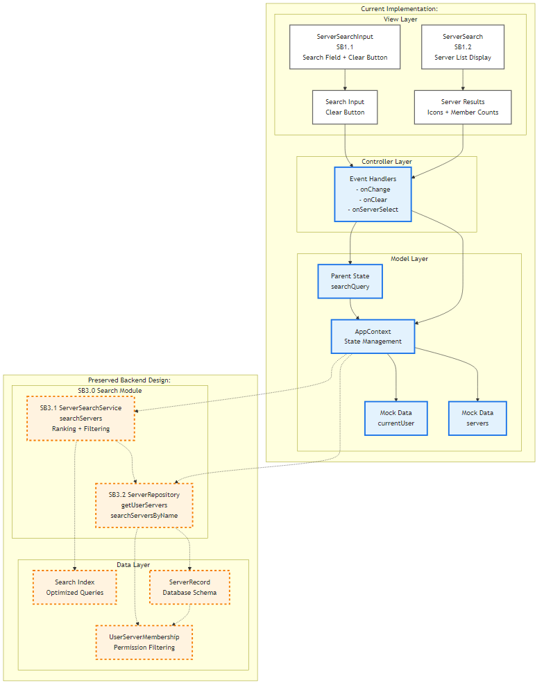
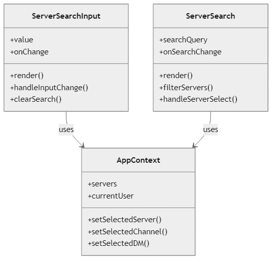
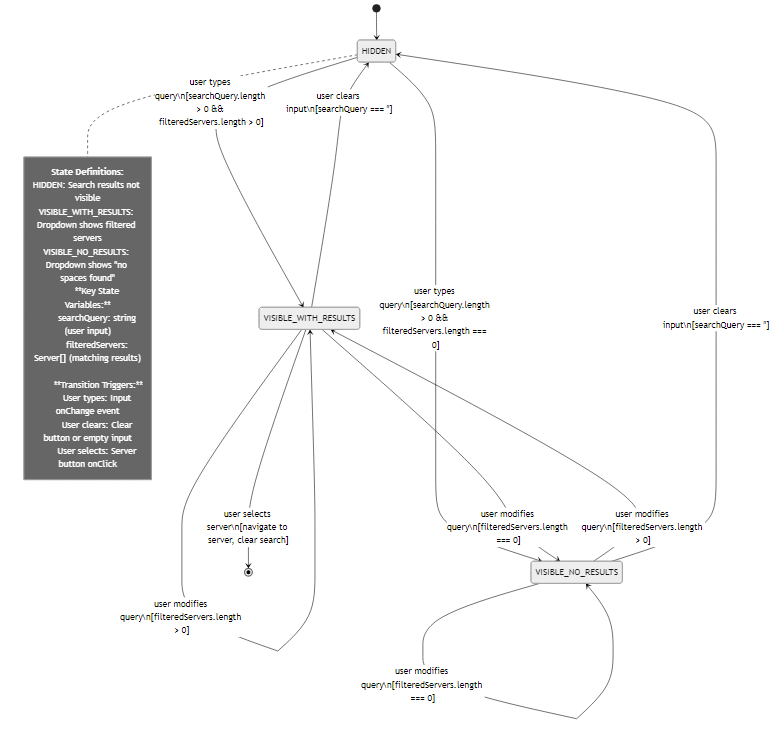

# Dev Specification Document
**Project:** Web‑Based Discord Clone with Enhanced Usability Features
**Feature:** Clear Server Search Bar
**Version:** v2.0

## 1. Document Version History

| Version | Date | Editor | Summary of Changes |
| :--- | :--- | :--- | :--- |
| 0.1 | 2026-02-11 | Salma Ghazi | Initial Draft; Document created; header established |
| 0.2 | 2026-02-15 | Elvis Valcarcel | Draft revision to add architecture/techstack rationale |
| 2.0 | 2026-03-03 | Salma Ghazi | Updated diagrams to match actual ServerSearch.tsx implementation, optimized content, removed fluff |

### Authors & Contributors
| Name | Role / Responsibility | Contributed Versions |
| :--- | :--- | :--- |
| Salma Ghazi | Product / Spec Author | v0.1 |
| Elvis Valcarcel | Editor | v0.2 |
| Salma Ghazi | Technical Update | v2.0 |

## 2. Architecture Diagram

### 2.2 Architecture Description

The Clear Server Search Bar follows the **Model-View-Controller (MVC)** architecture pattern with clear separation of concerns:

#### **View Layer (Client Side)**
- **SB1.1 ServerSearchInput**: The search input field with clear button that handles user text input and clearing functionality
- **SB1.2 ServerSearch**: The server list display component that renders filtered server results with server icons, names, and member counts

#### **Controller Layer (Client Side)**
- **Event Handlers**: Manages user interactions including:
  - `onChange`: Handles text input changes in the search field
  - `onClear`: Clears the search query when the X button is clicked
  - `onServerSelect`: Handles server selection from the filtered results

#### **Model Layer (Client Side)**
- **AppContext**: Central state management that stores and provides:
  - `servers`: Complete list of available servers
  - `currentUser`: Current user information for membership filtering
  - `searchQuery`: Current search query string for filtering

#### **MVC Data Flow**
1. **View → Controller**: User interactions (typing, clicking clear, selecting server) trigger event handlers
2. **Controller → Model**: Event handlers update the search query state in AppContext
3. **Model → View**: AppContext provides filtered server data back to View components for rendering
4. **Continuous Loop**: The search filtering happens in real-time as the user types, with the Model managing the filtering logic and View updating the display

This architecture ensures that the search functionality is entirely client-side, providing instant feedback without server requests for each search operation.

### Rationale and Justification:
This architecture follows MVC (Model-View-Controller) pattern with React components serving as Views, the AppContext providing the Model layer, and user interactions handling the Controller logic. The search is entirely client-side for performance, filtering the already-loaded server list without additional API calls.

## 3. Class Diagrams

**Actual Implementation (Client-Side Components with Mock Data):**

**Class: SB1.1 ServerSearchInput**
* **Props Interface**: `ServerSearchInputProps` (lines 62-67)
  - `value: string` - Current search query value
  - `onChange: (value: string) => void` - Search input change handler
* **Key Functions**:
  - Search input rendering with clear button functionality (lines 70-87)
  - Clear button appears when `value` is not empty (lines 78-84)

**Class: SB1.2 ServerSearch**
* **Props Interface**: `ServerSearchProps` (lines 7-10)
  - `searchQuery: string` - Current search query
  - `onSearchChange: (query: string) => void` - Search change handler
* **Global State**: `servers`, `currentUser`, `setSelectedServer`, `setSelectedChannel`, `setSelectedDM` from AppContext via `useApp()` hook (line 13)
* **Key Functions**:
  - Server filtering by user membership (line 15)
  - Server filtering by search query (lines 17-19)
  - Server selection handler (lines 37-41)
  - Conditional rendering - returns null if no search query (line 21)

**Current Implementation Architecture:**
The Server Search feature uses **two React components** that implement View and Controller responsibilities:
- **View Layer**: ServerSearchInput renders the search field with clear button, ServerSearch renders the dropdown results
- **Controller Layer**: Event handlers manage search input changes, clearing, and server selection
- **Model Layer**: AppContext provides global state (`servers`, `currentUser`) and navigation methods

**Backend Design (Preserved for Future Server Implementation):**

**SB3.1 ServerSearchService**
* **Current Implementation**: Client-side filtering in ServerSearch component (lines 15-19)
* **Future Backend**: Server-side search service with `searchServers(query, userId)` method
* **Purpose**: Server-side server search with advanced filtering, ranking, and permissions

**SB3.2 ServerRepository**
* **Current Implementation**: `servers` array from AppContext (line 13)
* **Future Backend**: Server-side data access with `getUserServers(userId)` and `searchServersByName(query, userId)` methods
* **Purpose**: Server-side server data retrieval and search indexing

### Rationale and Justification:
This class structure follows MVC architecture with clear separation of View components (ServerSearchInput, ServerSearch), Controller logic (UserInteractions), and Model data (AppContext). The View components handle UI rendering, the Controller handles user interactions and business logic, and the Model manages application state and data.

## 4. List of Classes

### Actual Implementation: React Components

**Class: SB1.1 ServerSearchInput**
* **Purpose & Responsibility:** Search input component with clear button functionality. Renders the search field and handles user text input with immediate visual feedback.
* **Implements Design Features:** Clear Server Search Bar (input field), Clear button with conditional visibility, Client-side input handling.
* **Props:** `value`, `onChange`
* **Data Sources:** Parent component state for search query

**Class: SB1.2 ServerSearch**
* **Purpose & Responsibility:** Dropdown results component that filters and displays servers based on user membership and search query. Handles server selection and navigation updates.
* **Implements Design Features:** Clear Server Search Bar (results display), User membership filtering, Real-time search filtering, Navigation state management.
* **Props:** `searchQuery`, `onSearchChange`
* **Data Sources:** AppContext for servers, user data, and navigation methods

### Backend Design (Preserved for Future Server Implementation)

**SB3.1 ServerSearchService**
* **Purpose & Responsibility:** Server-side search service with `searchServers(query, userId)` method for advanced server search with ranking algorithms and permission filtering.
* **Implements Design Features:** Clear Server Search Bar (server-side search), Advanced filtering, Search ranking, Permission validation.
* **Current Mock:** Client-side filtering in ServerSearch component using array methods.

**SB3.2 ServerRepository**
* **Purpose & Responsibility:** Server-side data access with `getUserServers(userId)` and `searchServersByName(query, userId)` methods for server data retrieval and search indexing.
* **Implements Design Features:** Clear Server Search Bar (data access), User membership validation, Search optimization.
* **Current Mock:** `servers` array from AppContext with client-side filtering.

### Data Storage Classes / Structures

**Class: SB3.1 ServerData**
* **Purpose & Responsibility:** Data structure representing server information including server icons, names, and member counts. Used for filtering and display operations.
* **Implements Design Features:** Clear Server Search Bar (display & filtering data model), Efficient UI rendering and comparisons.

**Class: SB3.2 UserData**
* **Purpose & Responsibility:** User context and authentication data including `currentUser` information used for filtering accessible servers based on membership.
* **Implements Design Features:** Clear Server Search Bar (user-specific server filtering), Security and access control.

### Rationale and Justification:
Each class maps to a component in the MVC architecture. The View components handle UI rendering and user interaction capture, the Controller handles business logic and coordination, and the Model manages data and state. This separation ensures clean architecture and maintainability.

## 5. State Diagrams

## 6. Flow Charts (Scenario‑Based)

#### Scenario: SC1.0 Server Search With Matching Results
**Starting State:** HIDDEN
**Ending State:** VISIBLE_WITH_RESULTS

1. **[Start]** → **[State]** HIDDEN (Search dropdown not visible)
2. **[Input/Output]** User types in ServerSearchInput → **[Controller]** `onChange` event triggered
3. **[Process]** Parent component updates search query state and passes to ServerSearch props
4. **[Process]** Transition to VISIBLE_WITH_RESULTS
5. **[Process]** ServerSearch component gets `servers` and `currentUser` from AppContext (line 13)
6. **[Process]** Filter servers by user membership: `userServers = servers.filter(s => s.members.includes(currentUser?.id))` (line 15)
7. **[Process]** Filter servers by search query: `filteredServers = userServers.filter(server => server.name.toLowerCase().includes(searchQuery.toLowerCase()))` (lines 17-19)
8. **[Decision]** `filteredServers.length > 0?`
    * **Yes** → **[View]** Display server list with icons, names, member counts (lines 27-53) → **(End)**
    * **No** → (Handled by SC1.1)

**Explanation:** The search begins hidden. User typing in ServerSearchInput triggers the `onChange` event, which updates the parent state and re-renders ServerSearch with new props. ServerSearch filters servers using AppContext data and displays results.

#### Scenario: SC1.1 Server Search With No Matching Results
**Starting State:** HIDDEN
**Ending State:** VISIBLE_NO_RESULTS

1. **[Start]** → **[State]** HIDDEN (Search dropdown not visible)
2. **[Input]** User types in ServerSearchInput → **[Controller]** `onChange` event triggered
3. **[Process]** Parent component updates search query state and passes to ServerSearch props
4. **[Process]** Transition to VISIBLE_NO_RESULTS
5. **[Process]** ServerSearch component gets `servers` and `currentUser` from AppContext
6. **[Process]** Filter servers by user membership (line 15)
7. **[Process]** Filter servers by search query (lines 17-19)
8. **[Decision]** `filteredServers.length > 0?`
    * **Yes** → (Handled by SC1.0)
    * **No** → **[View]** Display 'No spaces found' message (line 28) → **(End)**

**Explanation:** Similar to successful search but displays empty state when no servers match the query. All filtering happens client-side in the ServerSearch component.

#### Scenario: SC1.2 User Selects Server
**Starting State:** VISIBLE_WITH_RESULTS
**Ending State:** HIDDEN

1. **[Start]** → **[State]** VISIBLE_WITH_RESULTS
2. **[Input]** User clicks server from results → **[Controller]** `onClick` event triggered (line 37)
3. **[Process]** ServerSearch calls `setSelectedServer(server)` from AppContext (line 38)
4. **[Process]** Clear selected channel: `setSelectedChannel(null)` (line 39)
5. **[Process]** Clear selected DM: `setSelectedDM(null)` (line 40)
6. **[Process]** Clear search query: `onSearchChange('')` (line 41)
7. **[Process]** Transition to HIDDEN (component returns null due to empty searchQuery) → **(End)**

**Explanation:** Server selection triggers navigation state updates in AppContext and clears the search query, which hides the ServerSearch component.

#### Scenario: SC1.3 User Clears Search
**Starting State:** VISIBLE_WITH_RESULTS OR VISIBLE_NO_RESULTS
**Ending State:** HIDDEN

1. **[Start]** → **[State]** VISIBLE_WITH_RESULTS OR VISIBLE_NO_RESULTS
2. **[Input]** User clicks clear button (X) in ServerSearchInput → **[Controller]** `onClick` event triggered (line 80)
3. **[Process]** ServerSearchInput calls `onChange('')` to clear search (line 81)
4. **[Process]** Parent component updates search query state to empty string
5. **[Process]** ServerSearch component returns null due to empty searchQuery (line 21)
6. **[Process]** Transition to HIDDEN → **(End)**

**Explanation:** Clicking the clear button in ServerSearchInput clears the search query, causing ServerSearch to return null and hide the dropdown.

### Rationale and Justification:
The flow charts cover all primary user interactions with the search bar: typing queries, viewing results, selecting servers, and clearing searches. These scenarios represent the complete user journey through the search functionality.

## 7. Possible Threats and Failures

### Component: SB1.0 Search Components (View)

| Failure Mode | Description | Recovery Procedure | Likelihood | Impact |
| :--- | :--- | :--- | :--- | :--- |
| **FM‑SB1‑01 Runtime Crash** | UI rendering or component logic triggers an unrecoverable exception. | Restart client view lifecycle, reinitialize component state. | Medium | High |
| **FM‑SB1‑02 Loss of Runtime State** | Active search query lost during UI updates. | Rehydrate state from last known AppContext snapshot. | High | Medium |
| **FM‑SB1‑03 Unexpected State Transition** | UI enters incorrect state (e.g., results without query). | Force state recomputation via component re-render. | Medium | Medium |
| **FM‑SB1‑04 Resource Exhaustion (Client)** | Excessive DOM updates degrade performance. | Throttle render cycles, debounce input events. | Medium | Medium |

### Component: SB2.0 User Interactions (Controller)

| Failure Mode | Description | Recovery Procedure | Likelihood | Impact |
| :--- | :--- | :--- | :--- | :--- |
| **FM‑SB2‑01 Event Handling Errors** | `onChange`, `onClear`, or `onServerSelect` handlers fail to execute properly. | Reset event handlers, clear pending timeouts, restore last known state. | Medium | Medium |
| **FM‑SB2‑02 Search Query State Issues** | `searchQuery` state becomes out of sync with UI input. | Re-sync state from DOM value, clear corrupted state. | Medium | Medium |

### Component: SB3.0 App Context (Model)

| Failure Mode | Description | Recovery Procedure | Likelihood | Impact |
| :--- | :--- | :--- | :--- | :--- |
| **FM‑SB3‑01 Data Corruption** | `servers` array or `currentUser` data becomes inconsistent. | Invalidate context, refetch from source API. | Low | High |
| **FM‑SB3‑02 State Loss** | `searchQuery`, `servers`, or `currentUser` state cleared unexpectedly. | Restore from localStorage or re-initialize from API. | Medium | High |
| **FM‑SB3‑03 Navigation Errors** | Server selection fails to update routing. | Force navigation update, validate state. | Medium | Medium |

### Connectivity Failures

* **FM‑CON‑01 Network Loss:** Search data unavailable. *Recovery:* Use cached context data.
* **FM‑CON‑02 Third‑Party Service Failure:** Missing server icons. *Recovery:* Use placeholder assets.

### Ranking Summary

| Rank Category | Typical Failures |
| :--- | :--- |
| **High Likelihood / Medium Impact** | Loss of Runtime State, Event Handling Errors, Search Query State Issues |
| **Medium Likelihood / High Impact** | Runtime Crash, State Loss, Navigation Errors |
| **Low Likelihood / Critical Impact** | Data Corruption |

### Rationale and Justification:
Failure modes are categorized by MVC components, focusing on client-side issues since the search functionality is entirely browser-based. Recovery procedures emphasize state restoration and graceful degradation.

## 8. Technologies

| Technology | Version | Purpose | Justification vs Alternatives |
| :--- | :--- | :--- | :--- |
| **[TECH‑01 TypeScript](https://www.typescriptlang.org/docs/)** | 5.x | Client logic/UI | Static typing improves maintainability vs plain JS and aligns with component interfaces. |
| **[TECH‑02 React](https://react.dev/)** | 18.x | UI Framework | Component model maps to View components; state management fits Model layer; strong ecosystem. |
| **[TECH‑03 Lucide React](https://lucide.dev/)** | Latest | Icons | Consistent iconography for search and clear buttons vs custom SVGs. |
| **[TECH‑04 Tailwind CSS](https://tailwindcss.com/)** | 3.x | Styling | Utility-first CSS for responsive search UI vs traditional CSS frameworks. |
| **[TECH‑05 Radix UI](https://www.radix-ui.com/)** | Latest | UI Primitives | Accessible dropdown components vs custom implementations. |

### Rationale and Justification:
Technology stack optimized for client-side MVC architecture pattern. React handles View components (SB1.0), TypeScript provides Controller logic (SB2.0) type safety for event handlers, and AppContext serves as the Model (SB3.0). All technologies support the browser-only deployment model with real-time search functionality.

## 9. APIs & Public Interfaces

### Component: SB1.0 Search Components (View)

#### Class: SB1.1 ServerSearchInput
* **Public Methods**
    * `render() : ReactElement`
    * `handleInputChange(value: string) : void` - Triggers `onChange` event
    * `clearSearch() : void` - Triggers `onClear` event
* **Event Handlers**
    * `onChange: (value: string) => void`
    * `onClear: () => void`

#### Class: SB1.2 ServerSearch
* **Public Methods**
    * `render() : ReactElement`
    * `handleServerSelect(server: Server) : void` - Triggers `onServerSelect` event
    * `filterServers(query: string) : Server[]`
* **Event Handlers**
    * `onServerSelect: (server: Server) => void`

### Component: SB2.0 User Interactions (Controller)

#### Class: SB2.0 UserInteractions
* **Public Methods**
    * `onChange(value: string) : void` - Updates search query in AppContext
    * `onClear() : void` - Clears search query in AppContext
    * `onServerSelect(server: Server) : void` - Updates selected server in AppContext
* **State Management**
    * Updates `searchQuery` state in AppContext
    * Triggers server selection and navigation updates

### Component: SB3.0 App Context (Model)

#### Class: SB3.0 AppContext
* **Public Methods**
    * `getServers() : Server[]` - Returns all available servers
    * `getCurrentUser() : User` - Returns current user context
    * `getSearchQuery() : string` - Returns current search query
    * `setSearchQuery(query: string) : void` - Updates search query state
    * `setSelectedServer(server: Server) : void` - Updates selected server
    * `setSelectedChannel(channel: Channel | null) : void` - Clears selected channel
    * `setSelectedDM(dm: DirectMessage | null) : void` - Clears selected DM
* **State Properties**
    * `servers: Server[]` - Complete server list
    * `currentUser: User` - User authentication data
    * `searchQuery: string` - Current search query

### Data Structures

#### Class: SB3.1 ServerData
* **Public Methods**
    * `getId() : string`
    * `getName() : string`
    * `getIcon() : string`
    * `getMembers() : string[]`

#### Class: SB3.2 UserData
* **Public Methods**
    * `getId() : string`
    * `getUsername() : string`

### Rationale and Justification:
API interfaces follow MVC separation with View components exposing rendering methods, Controller handling user interactions, and Model providing data access methods. This maintains clean architectural boundaries.

## 10. Public Interfaces

### Component: SB1.0 Search Components (View)

**External Dependencies — SB1.0 Uses:**
* **From SB2.0 User Interactions (Controller):** Event handling and user interaction processing.
* **From SB3.0 App Context (Model):** Server data and navigation state management.

### Component: SB2.0 User Interactions (Controller)

**External Dependencies — SB2.0 Uses:**
* **From SB1.0 Search Components (View):** User input capture and result display via `onChange`, `onClear`, `onServerSelect` events.
* **From SB3.0 App Context (Model):** State updates for `searchQuery`, `servers`, and `currentUser` data.

### Component: SB3.0 App Context (Model)

**Public Methods Exposed to SB1.0 and SB2.0:**
* `getServers()` — Provides server list for filtering.
* `getCurrentUser()` — Provides user context for membership filtering.
* `getSearchQuery()` — Provides current search query state.
* `setSearchQuery()` — Updates search query from Controller events.
* `setSelectedServer()` — Updates navigation state from server selection.

### Rationale and Justification:
Public interfaces maintain MVC separation with clear dependencies between View, Controller, and Model components. The Model exposes data access methods while Controller coordinates interactions.

## 11. Data Schemas

### Database Data Type: DS‑01 ServerRecord
* **Primary Runtime Owner:** SB3.0 AppContext (Model)
* **Description:** Persistent representation of servers loaded into client-side state.

**Columns:**
* `server_id` (UUID): Primary key.
* `server_name` (VARCHAR 100): Server display name.
* `server_icon` (TEXT): Server icon URL.
* `created_at` (TIMESTAMP): Creation timestamp.

### Database Data Type: DS‑02 UserServerMembershipRecord
* **Primary Runtime Owner:** SB3.0 AppContext (Model)
* **Description:** Links users to accessible servers for filtering in search results.

**Columns:**
* `user_id` (UUID): Foreign key to user.
* `server_id` (UUID): Foreign key to server.
* `joined_at` (TIMESTAMP): Membership timestamp.

### Database Data Type: DS‑03 UserRecord
* **Primary Runtime Owner:** SB3.0 AppContext (Model)
* **Description:** User authentication and profile data for membership filtering.

**Columns:**
* `user_id` (UUID): Primary key.
* `username` (VARCHAR 50): Display name.
* `email` (VARCHAR 255): Contact email.
* `created_at` (TIMESTAMP): Registration timestamp.

### Rationale and Justification:
Data schemas support the MVC Model layer with normalized relationships between users and servers. UUIDs ensure global uniqueness while timestamps track data lifecycle.

## 12. Risks to Completion

### MVC Component-Level Risks

**SB1.0 Search Components (View)**
* **Rendering Performance:** Frequent re-renders during typing may cause UI lag.
* **Accessibility Issues:** Screen reader support for dynamic search results.
* **Browser Compatibility:** Input handling differences across browsers.

**SB2.0 User Interactions (Controller)**
* **Event Handling Complexity:** Managing `onChange`, `onClear`, and `onServerSelect` events with proper debouncing.
* **Race Conditions:** Multiple rapid interactions causing inconsistent `searchQuery` state.
* **State Update Timing:** Ensuring Controller updates Model before View re-renders.

**SB3.0 App Context (Model)**
* **State Synchronization:** Ensuring consistent `searchQuery`, `servers`, and `currentUser` state across components.
* **Memory Leaks:** Context subscriptions not properly cleaned up when components unmount.
* **Data Integrity:** Maintaining accurate server filtering based on `searchQuery` and user membership.

### Technology Risks

**React State Management**
* **Re-rendering Issues:** Unnecessary component updates affecting search performance.
* **Hook Dependencies:** Complex useEffect dependencies for `searchQuery` state management.
* **Context Provider Scope:** Ensuring AppContext properly wraps search components.

**Browser API Limitations**
* **Input Event Differences:** onChange vs onInput vs onKeyUp behavior variations.

### Integration Risks

* **Context Provider Setup:** Ensuring AppContext is available to all search components.
* **Prop Threading:** Passing search state through component hierarchy.

### Mitigation Strategies

* Comprehensive unit testing for each MVC layer.
* Integration testing for component interactions.
* Performance monitoring and optimization.
* Cross-browser testing and polyfills.

## 13. Security & Privacy

### Temporary Handling of PII

**PII Elements**
* `user_id` - User identification for server membership filtering in Model.
* `username` - Display name in search results (View).
* `server memberships` - User's accessible servers stored in AppContext (Model).
* `searchQuery` - User's search input (temporarily in Controller/Model state).

**Justification**
* Required for filtering servers based on user permissions.
* Essential for displaying relevant search results.

**Data Flow**
1. User types in search → View (SB1.1) captures input → Controller (SB2.0) `onChange` event
2. Controller updates `searchQuery` in Model (SB3.0 AppContext) → Filtering occurs client-side
3. Model provides filtered results to View (SB1.2) → No server transmission of search queries

**Protection Mechanisms**
* Client-side only processing - no server transmission.
* Data remains in browser memory only.
* No persistent storage of search queries.

### Long-Term Storage of PII

**Stored Data**
* User-server membership relationships.
* Server metadata (names, icons).

**Storage Method**
* PostgreSQL database with proper indexing.
* Encrypted connections and access controls.

**Data Exit Paths**
* AppContext data loading.
* Server filtering operations.

### Security Responsibilities

* **Client Security:** Input validation and XSS prevention.
* **Data Security:** Database access controls and encryption.
* **Network Security:** HTTPS transport encryption.

### Privacy Considerations

* No search query logging or analytics.
* Client-side filtering prevents server-side data exposure.
* Minimal data retention focused on functionality.

### Rationale and Justification:
Security measures prioritize user privacy by keeping search operations client-side. No search queries are transmitted to servers, reducing privacy risks while maintaining functionality. MVC architecture supports clean separation of security concerns.
