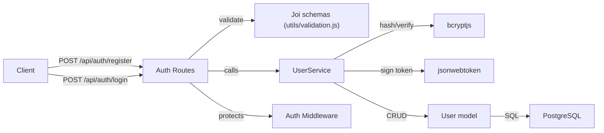
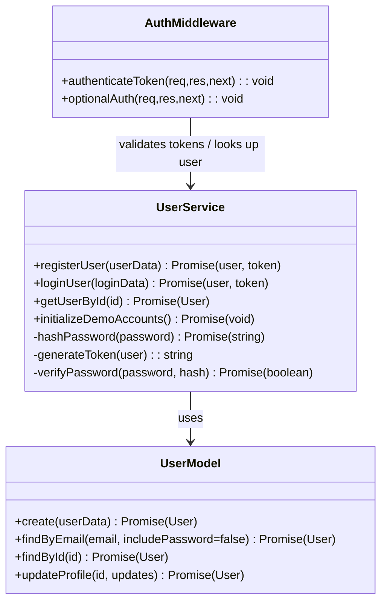

# Authentication Module

## 1. Features

- Register new users with username / email / password validation.
- Login users returning a signed JWT token.
- Verify JWT tokens on protected routes (middleware).
- Initialize demo accounts for development.

Not included:
- OAuth / social login, refresh tokens, MFA, account deletion, password resets.

---

## 2. Design & Internal architecture

Text description

The Authentication module is a layered service that cleanly separates concerns:
- HTTP layer: Express route handlers receive requests and translate HTTP concerns (status codes, JSON bodies) into calls to the service layer.
- Validation layer: Joi schemas validate incoming request bodies before business logic runs; validation is applied per-route.
- Service layer (`userService`): implements business rules — password hashing, credential verification, token generation, and demo-account setup.
- Model/DB layer (`User` model + `pg` pool): performs SQL CRUD and queries against PostgreSQL and enforces storage-level invariants.
- Middleware (`authenticateToken` / `optionalAuth`): lightweight Express middleware that verifies JWTs and attaches `req.user`.

Design justification (for senior architect)

- Separation of concerns: keeping business logic in `userService` makes it unit-testable without HTTP or database concerns, and reduces duplication across routes.
- Per-route `Joi` validation: explicit validation at the route boundary prevents malformed inputs from reaching business logic and keeps schemas discoverable and close to the HTTP API.
- Stateless auth via JWT: tokens are compact, scalable (no server-side session store), and fit the app's expected horizontal scaling model; secrets and expirations are enforced centrally.
- PostgreSQL for durability: user accounts are critical data; using a relational DB allows unique constraints, transactions, and ACID semantics for correctness (e.g., when creating a user and related metadata).
- Minimal middleware: `authenticateToken` is single-responsibility and keeps downstream code focused on authorization assumptions rather than token parsing.

Mermaid view



---

## 3. Data abstraction

Primary abstractions (developer-facing ADTs)

- User (entity): { id, username, email, password_hash, display_name, avatar, status, created_at, updated_at }
- JWT Token (opaque string): encodes `{id, username, email}` and expiry.

Formal viewpoint (6.005 reading 13 style)

Treat `User` as an abstract data type (ADT) with operations that hide representation details:

- `create(userData) -> User`
- `findById(id) -> User | null`
- `findByEmail(email, includePassword=false) -> User | null`
- `updateProfile(id, updates) -> User`

Clients interact only with these operations and never manipulate the SQL row directly; invariants (unique username/email, password hashing) are enforced by the ADT.

---

## 4. Stable storage

- PostgreSQL (via `pg.Pool`) — durable persistent storage used by the app; connection pooling is configured in `simple-server/config/database.js`.
- Use database-level constraints (UNIQUE, CHECK) and transactions for correctness when mutating multiple related rows.

### 4a. Data schemas (SQL)

Users table (existing schema used by the app):

```sql
CREATE TABLE users (
  id VARCHAR(255) PRIMARY KEY,
  username VARCHAR(50) UNIQUE NOT NULL,
  email VARCHAR(255) UNIQUE NOT NULL,
  password_hash VARCHAR(255) NOT NULL,
  display_name VARCHAR(50),
  avatar VARCHAR(500),
  status VARCHAR(20) DEFAULT 'offline' CHECK (status IN ('online','idle','dnd','offline')),
  created_at TIMESTAMP DEFAULT CURRENT_TIMESTAMP,
  updated_at TIMESTAMP DEFAULT CURRENT_TIMESTAMP
);
```

Index suggestions:

- `CREATE INDEX idx_users_username ON users(username);`
- `CREATE INDEX idx_users_email ON users(email);`

---

## 5. External API (REST)

All responses follow `{ success: boolean, message?: string, data?: object }`.

Authentication endpoints (implemented):

- POST `/api/auth/register`
  - Body: `{ username, email, password }`
  - Returns: `201 { success:true, data: { user, token } }`
  - Validates body with `registerSchema`.

- POST `/api/auth/login`
  - Body: `{ email, password }`
  - Returns: `200 { success:true, data: { user, token } }`
  - Validates body with `loginSchema`.

- GET `/api/auth/me`
  - Protected: requires `Authorization: Bearer <token>`
  - Returns: `200 { success:true, data: { user } }`

Error semantics

- `400` for validation errors or malformed requests
- `401` for missing or invalid credentials
- `403` for invalid/expired JWT where applicable
- `500` for unexpected server errors

---

## 6. Classes, methods, and fields

`middleware/auth.js` (public)
- `authenticateToken(req, res, next)` — verifies token, attaches `req.user`.
- `optionalAuth(req, res, next)` — attaches `req.user` or `null`.

`services/userService.js` (public API)
- `registerUser(userData) -> Promise<{user, token}>` — hashes password, creates user, returns token.
- `loginUser(loginData) -> Promise<{user, token}>` — verifies password, returns user+token.
- `getUserById(id) -> Promise<User>`
- `initializeDemoAccounts() -> Promise<void>`

Internal/private helpers (module-private)
- `hashPassword(password) -> Promise<string>`
- `generateToken(user) -> string`
- `verifyPassword(password, hash) -> Promise<boolean>`

`models/User.js` (data access functions)
- `create(userData) -> Promise<User>`
- `findByEmail(email, includePassword=false) -> Promise<User|null>`
- `findById(id) -> Promise<User|null>`
- `updateProfile(id, updates) -> Promise<User>`

Visibility notes

- Route handlers and `middleware/auth.js` are part of the HTTP surface.
- `userService` functions are the module's public business API; model functions are DAOs used by the service and are not exported as part of the HTTP API.

---

## 7. Module-internal class diagram



---

## Notes for implementers / reviewers

- The service layer should never return the `password_hash` field to callers; always strip it before forming responses.
- `JWT_SECRET` and token expiry must be configured via environment variables; treat secrets securely.
- `initializeDemoAccounts` is idempotent and intended for development only — avoid relying on demo accounts in production tests.
