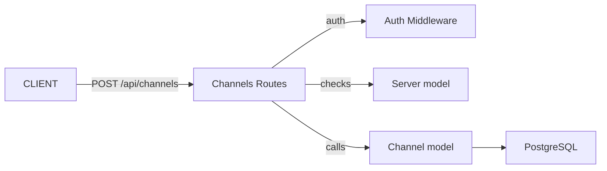
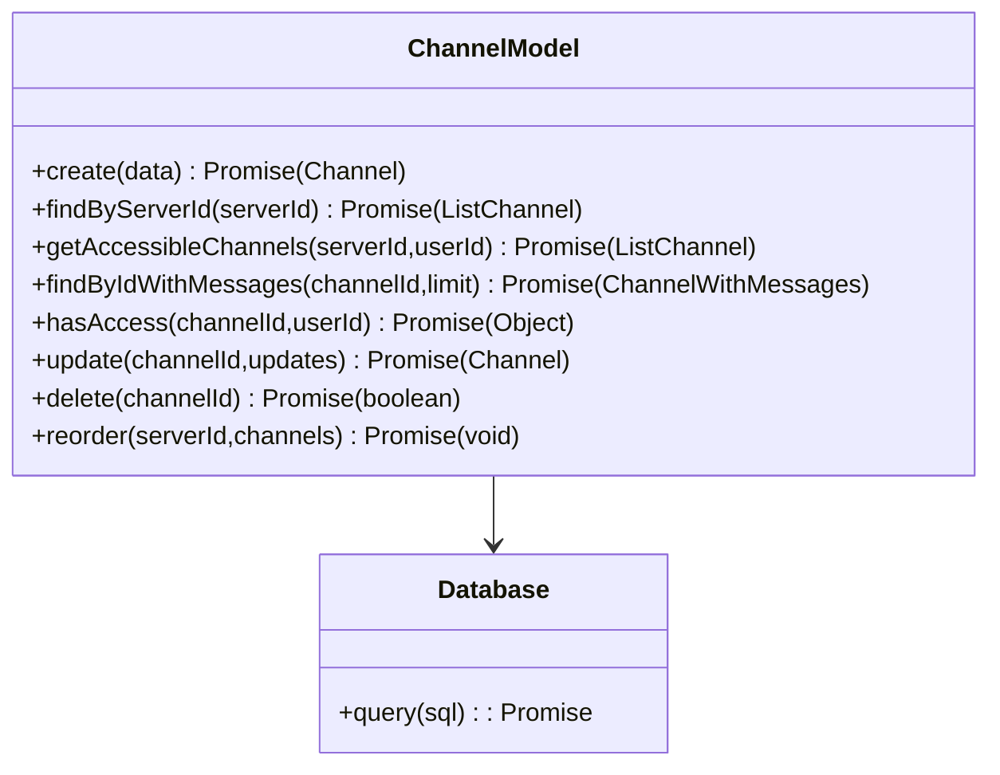

# Channels Module

## 1. Features

- Create channels in a server (owner/admin only).
- List channels for a server (only accessible to server members).
- Read a channel with recent messages (paginated by limit).
- Update channel metadata (name, position) for owner/admin.
- Delete channels (owner/admin only).
- Reorder channels within a server (owner/admin only).

Not included:
- Channel permissions beyond simple server-level roles (owner/admin/member).

---

## 2. Design & Internal architecture

Text description

Channels are a thin abstraction representing ordered chat containers inside a server. Routes perform membership/permission checks then delegate to `Channel` model functions for CRUD and queries. Reordering and creation compute/maintain `position` to present stable ordering to clients.

Design justification

- Keep permission logic at the route boundary using `Server.isMember()` and `Channel.hasAccess()` so model functions can be reused by other services.
- Use `position` integer for channel ordering to enable quick reordering and database-level updates.
- Return channel lists as lightweight objects (id, name, position, serverId) to keep payload small.

Mermaid view



---

## 3. Data abstraction

Primary ADT

- Channel: { id, name, server_id, position, created_at, updated_at }

ADT operations

- `create({id,name,serverId,position}) -> Channel`
- `findByServerId(serverId) -> [Channel]`
- `getAccessibleChannels(serverId, userId) -> [Channel]`
- `findByIdWithMessages(channelId, limit) -> ChannelWithMessages`
- `hasAccess(channelId, userId) -> { has_access, role? }`
- `update(channelId, updates) -> Channel`
- `delete(channelId) -> boolean`
- `reorder(serverId, channels) -> void`

---

## 4. Stable storage

- PostgreSQL (via `pg.Pool`) — channels stored in `channels` table with `position` integer.
- Use transactions for multi-row updates during reordering to ensure consistent `position` values.

### 4a. Data schema (excerpt)

```sql
CREATE TABLE channels (
  id VARCHAR(255) PRIMARY KEY,
  name VARCHAR(255) NOT NULL,
  server_id VARCHAR(255) NOT NULL,
  position INTEGER DEFAULT 0,
  FOREIGN KEY (server_id) REFERENCES servers(id) ON DELETE CASCADE
);
```

---

## 5. External API (REST)

- POST `/api/channels` — Auth required; body `{ name, serverId }` — 201 returns `{ channel }`.
- GET `/api/channels/server/:serverId` — Auth required; returns `{ channels }` for members.
- GET `/api/channels/:channelId` — Auth required; returns `{ channel }` including recent messages.
- PUT `/api/channels/:channelId` — Auth required; owner/admin only; updates name/position.
- DELETE `/api/channels/:channelId` — Auth required; owner/admin only.
- PUT `/api/channels/server/:serverId/reorder` — Auth required; owner/admin only; body `{ channels: [{ channelId, position }] }`.

Error semantics: 400 validation, 401/403 auth/permission, 404 not found, 500 server errors.

---

## 6. Classes, methods, and fields

`routes/channel.js` (HTTP surface)
- `POST /` — create channel
- `GET /server/:serverId` — list channels
- `GET /:channelId` — get channel + messages
- `PUT /:channelId` — update channel
- `DELETE /:channelId` — delete channel
- `PUT /server/:serverId/reorder` — reorder channels

`models/Channel.js` (DAOs)
- `create(data) -> Promise<Channel>`
- `findByServerId(serverId) -> Promise<[Channel]>`
- `getAccessibleChannels(serverId, userId) -> Promise<[Channel]>`
- `findByIdWithMessages(channelId, limit) -> Promise<ChannelWithMessages>`
- `hasAccess(channelId, userId) -> Promise<{ has_access, role? }>`
- `update(channelId, updates) -> Promise<Channel>`
- `delete(channelId) -> Promise<boolean>`
- `reorder(serverId, channels) -> Promise<void>`

Visibility notes: Route handlers enforce auth and basic validation; model functions encapsulate storage and invariants.

---

## 7. Module-internal class diagram


