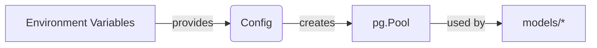
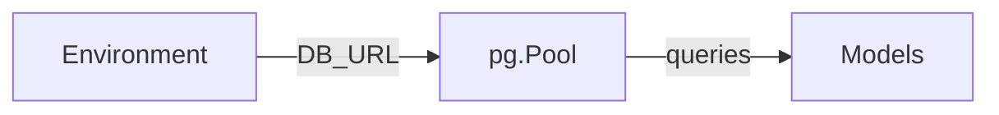

# Config (Support Layer)

## 1. Features

- Database configuration and pool initialization (`config/database.js`).
- Environment-driven settings (DB URL, JWT secret, optional ports).

---

## 2. Design & Internal architecture

Text description

Config centralizes environment-derived settings and constructs the `pg.Pool` used by models. Keep secrets out of source (use env or secrets manager).

Mermaid view

Design justification

- Central config avoids duplicated environment parsing and ensures consistent pool sizing across the app.

---

## 3. Data abstraction

- No ADTs; config exposes initialized singletons (e.g., `pool`) and plain config objects.

---

## 4. Stable storage

- `config/database.js` returns a `pg.Pool` instance; models import and use it for queries.

---

## 5. External API (Exports)

- `module.exports = { pool }` from `config/database.js`.

---

## 6. Files and fields

- `config/database.js` — establishes `pg.Pool` with connection settings read from `process.env.DATABASE_URL` or individual env vars.

---

## 7. Diagram (conceptual)

