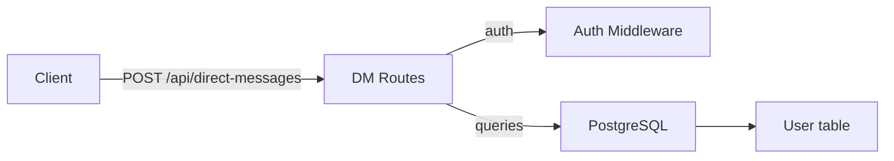
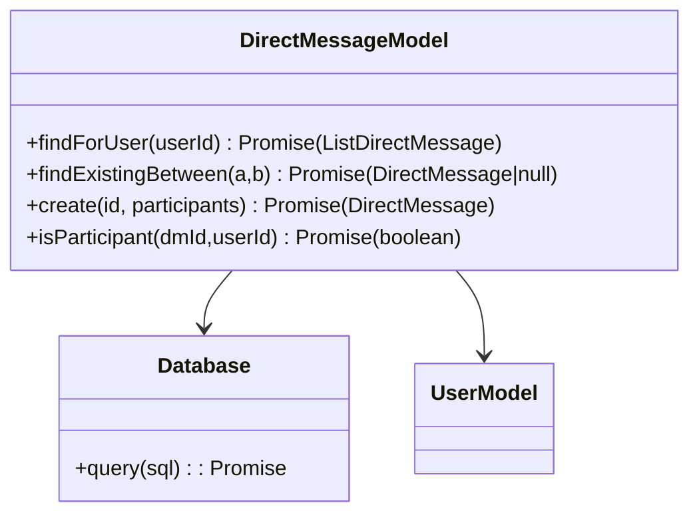

# Direct Messages (DMs) Module

## 1. Features

- Create DMs between two users (idempotent — returns existing if present).
- List DMs for the authenticated user (with "other user" display info).
- Fetch messages within a DM (paginated, `before` filter).
- Create messages in a DM (via messages endpoints).

Not included:
- Group DMs (more than two participants) are not supported by the public DM API.

---

## 2. Design & Internal architecture

Text description

DMs are stored in the `direct_messages` table as rows with `participants` (text array). The routes enforce participant checks by querying the `direct_messages` table to ensure the caller is listed. Creation reuses an existence check to avoid duplicates.

Design justification

- Simple representation (array of participant IDs) keeps DM lookup queries straightforward and avoids extra join tables for pairings.
- Return a view that includes the "other" user's profile to simplify client rendering.

Mermaid view



---

## 3. Data abstraction

Primary ADT

- DirectMessage: { id, participants: [userId, userId], last_message_time, created_at, updated_at }

ADT operations

- `getDirectMessagesForUser(userId) -> [DirectMessageWithOtherUserInfo]`
- `findOrCreateDM(userA, userB) -> DirectMessage`
- `createDM(participants) -> DirectMessage`
- `isParticipant(dmId, userId) -> boolean`

---

## 4. Stable storage

- PostgreSQL `direct_messages` table with `participants` (text[]) and timestamps.

### 4a. Data schema (excerpt)

```sql
CREATE TABLE direct_messages (
  id VARCHAR(255) PRIMARY KEY,
  participants TEXT[] NOT NULL,
  last_message_time TIMESTAMP,
  created_at TIMESTAMP DEFAULT CURRENT_TIMESTAMP,
  updated_at TIMESTAMP DEFAULT CURRENT_TIMESTAMP
);
```

---

## 5. External API (REST)

- GET `/api/direct-messages` — list DMs for current user (returns other user's display info)
- POST `/api/direct-messages` — body `{ userId }` — creates or returns existing DM between current user and `userId`
- GET `/api/messages/dm/:dmId` — fetch messages for DM (auth & participant required)
- POST `/api/messages` with `dmId` — create message in DM
- Search `/api/messages/search/dm/:dmId` — search messages in a DM

Error semantics: 400 validation, 401/403 auth/permission, 404 not found, 500 server errors.

---

## 6. Classes, methods, and fields

`routes/directMessages.js` (HTTP surface)
- `GET /` — list DMs for user
- `POST /` — create or fetch DM between two users

DB helper in `routes/message.js` / `routes/messages.js` reuses `direct_messages` queries to confirm participant access for message operations.

`direct_messages` storage usage:
- `find existing DM with participants @> ARRAY[userA,userB] and array_length = 2`
- `INSERT INTO direct_messages (id, participants) VALUES (...)`

---

## 7. Module-internal class diagram


