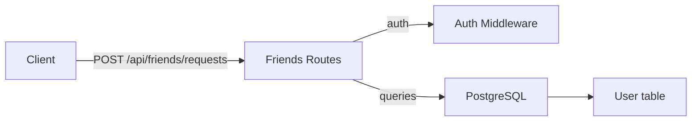
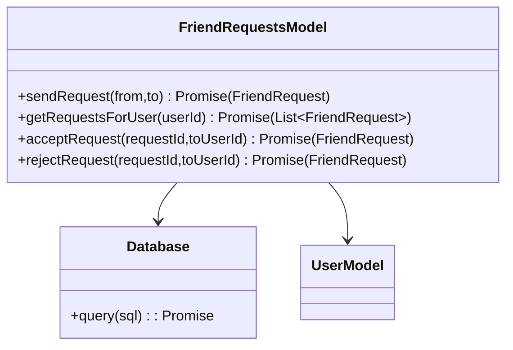

# Friends Module

## 1. Features

- List accepted friends for the authenticated user.
- List pending friend requests (incoming and outgoing).
- Send a friend request to another user.
- Accept or reject incoming friend requests.

Not included:
- Friend blocking, friend groups, or complex social features.

---

## 2. Design & Internal architecture

Text description

Friends are modeled via a `friend_requests` table with `from_user_id`, `to_user_id`, and `status` (`pending`, `accepted`, `rejected`). Routes query and update this table directly for requests, while `User.getFriends(userId)` aggregates accepted relationships.

Design justification

- Use a single `friend_requests` table to represent both pending and accepted relationships; this simplifies queries for mutual state and reduces synchronization logic.
- Keep route handlers simple and use SQL for joins to fetch user display data for requests.

Mermaid view



---

## 3. Data abstraction

Primary ADT

- FriendRequest: { id, from_user_id, to_user_id, status, created_at, updated_at }
- Friend (derived): pair of user IDs with status `accepted`

ADT operations

- `getFriends(userId) -> [User]`
- `getRequests(userId) -> [FriendRequest]` (pending incoming/outgoing)
- `sendRequest(fromUserId, toUserId) -> FriendRequest`
- `acceptRequest(requestId, toUserId) -> FriendRequest`
- `rejectRequest(requestId, toUserId) -> FriendRequest`

---

## 4. Stable storage

- PostgreSQL `friend_requests` table with indices on `from_user_id` and `to_user_id` for efficient lookups.

### 4a. Data schema (excerpt)

```sql
CREATE TABLE friend_requests (
  id VARCHAR(255) PRIMARY KEY,
  from_user_id VARCHAR(255) NOT NULL,
  to_user_id VARCHAR(255) NOT NULL,
  status VARCHAR(20) NOT NULL DEFAULT 'pending',
  created_at TIMESTAMP DEFAULT CURRENT_TIMESTAMP,
  updated_at TIMESTAMP DEFAULT CURRENT_TIMESTAMP
);

CREATE INDEX idx_friend_requests_from ON friend_requests(from_user_id);
CREATE INDEX idx_friend_requests_to ON friend_requests(to_user_id);
```

---

## 5. External API (REST)

- GET `/api/friends` — list accepted friends
- GET `/api/friends/requests` — list pending requests for current user
- POST `/api/friends/requests` — send request, body `{ toUserId }` — returns created request
- POST `/api/friends/requests/:requestId/accept` — accept incoming request
- POST `/api/friends/requests/:requestId/reject` — reject incoming request

Error semantics: 400 validation, 401 auth, 404 not found, 500 server errors.

---

## 6. Classes, methods, and fields

`routes/friends.js` (HTTP surface)
- `GET /` — list accepted friends
- `GET /requests` — list pending requests
- `POST /requests` — send request
- `POST /requests/:requestId/accept` — accept
- `POST /requests/:requestId/reject` — reject

`models/User.js` helpers
- `getFriends(userId) -> Promise<[User]>` — aggregates accepted friend rows

---

## 7. Module-internal class diagram


