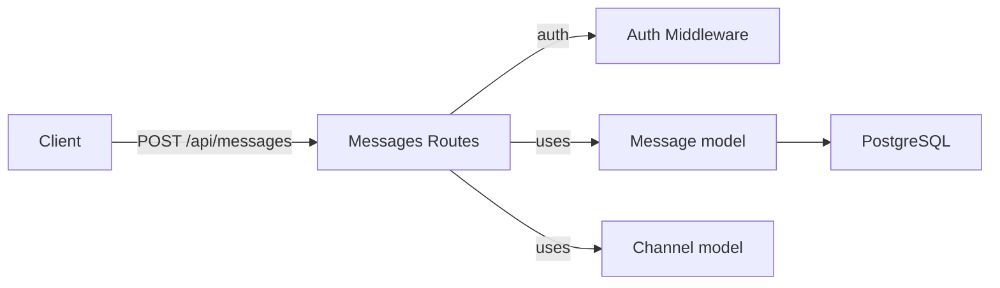
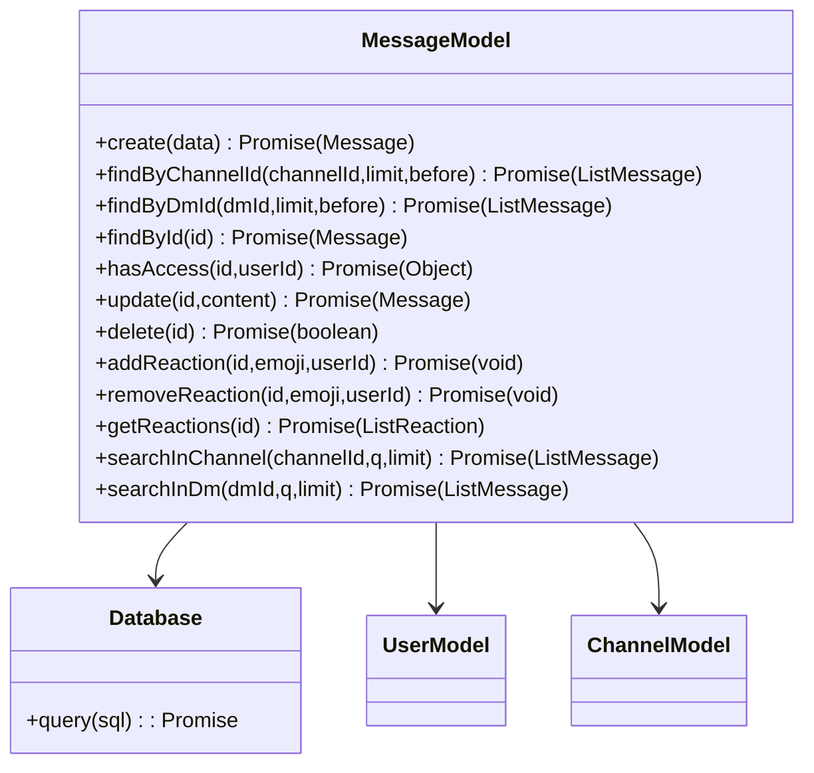

# Messages Module

## 1. Features

- Create messages in channels or direct messages (DMs).
- Edit and delete messages with access controls (author or server admin/owner).
- Fetch messages for a channel or DM, with pagination and "before" filtering.
- Search messages in a channel or DM (text query).
- Add/remove (toggle) reactions on messages; list reactions.
- Fetch a single message with reactions.

Not included:
- Long-term archival or message export features.

---

## 2. Design & Internal architecture

Text description

Message operations are centered on the `Message` model with route-level authorization checks. Read operations attach reactions by querying `message_reactions` and joining to `users`. Create/edit/delete enforce access via `Message.hasAccess()` which returns both existence and permission flags.

Design justification

- Keep access checks centralized (`Message.hasAccess`) to consistently enforce visibility and mutation permissions across endpoints.
- Reactions are stored in `message_reactions`; attach them to message lists after the primary message fetch to avoid complex joins when not needed.
- Provide `before`-style pagination to support infinite-scroll UI patterns.

Mermaid view



---

## 3. Data abstraction

Primary ADTs

- Message: { id, content, author_id, channel_id?, dm_id?, reply_to_id?, created_at, updated_at }
- Reaction: { message_id, emoji, user_id }

ADT operations

- `create(messageData) -> Message`
- `findByChannelId(channelId, limit, before) -> [Message]`
- `findByDmId(dmId, limit, before) -> [Message]`
- `findById(messageId) -> Message`
- `hasAccess(messageId, userId) -> { exists, has_access, author_id, channel_id }`
- `update(messageId, content) -> Message`
- `delete(messageId) -> boolean`
- `addReaction(messageId, emoji, userId) -> void`
- `removeReaction(messageId, emoji, userId) -> void`
- `getReactions(messageId) -> [{ emoji, users: [User] }]`
- `searchInChannel(channelId, q, limit) -> [Message]`
- `searchInDm(dmId, q, limit) -> [Message]`

---

## 4. Stable storage

- PostgreSQL tables: `messages`, `message_reactions`, plus `users` for joins.
- Use transactions for multi-step operations (e.g., create + post-processing) where required.

### 4a. Data schema (excerpt)

```sql
CREATE TABLE messages (
  id VARCHAR(255) PRIMARY KEY,
  content TEXT NOT NULL,
  author_id VARCHAR(255) NOT NULL,
  channel_id VARCHAR(255),
  dm_id VARCHAR(255),
  reply_to_id VARCHAR(255),
  created_at TIMESTAMP DEFAULT CURRENT_TIMESTAMP,
  updated_at TIMESTAMP DEFAULT CURRENT_TIMESTAMP
);

CREATE TABLE message_reactions (
  message_id VARCHAR(255) NOT NULL,
  emoji VARCHAR(255) NOT NULL,
  user_id VARCHAR(255) NOT NULL
);
```

---

## 5. External API (REST)

- GET `/api/messages/channels/:channelId` — fetch channel messages (auth, channel access required)
- GET `/api/messages/dm/:dmId` — fetch DM messages (auth, participant required)
- POST `/api/messages` — create message; body `{ content, channelId?|dmId?, replyToId? }` (exactly one of channelId/dmId)
- PUT `/api/messages/:messageId` — edit message (author or admin rules apply)
- DELETE `/api/messages/:messageId` — delete message (author or admin rules apply)
- POST `/api/messages/:messageId/reactions/toggle` — toggle reaction; returns updated reactions
- GET `/api/messages/:messageId/reactions` — list reactions
- GET `/api/messages/search/channel/:channelId` and `/api/messages/search/dm/:dmId` — search endpoints
- GET `/api/messages/:messageId` — fetch single message with reactions

Error semantics: 400 validation, 401/403 auth/permission, 404 not found, 500 server errors.

---

## 6. Classes, methods, and fields

`routes/messages.js` and `routes/message.js` expose message-related endpoints.

`models/Message.js` (data access)
- `create(data) -> Promise<Message>`
- `findByChannelId(channelId, limit, before) -> Promise<[Message]>`
- `findByDmId(dmId, limit, before) -> Promise<[Message]>`
- `findById(messageId) -> Promise<Message>`
- `hasAccess(messageId, userId) -> Promise<{ has_access, author_id, channel_id }>`
- `update(messageId, content) -> Promise<Message>`
- `delete(messageId) -> Promise<boolean>`
- `addReaction(messageId, emoji, userId) -> Promise<void>`
- `removeReaction(messageId, emoji, userId) -> Promise<void>`
- `getReactions(messageId) -> Promise<[ { emoji, users: [User] } ]>`
- `searchInChannel(channelId, q, limit) -> Promise<[Message]>`
- `searchInDm(dmId, q, limit) -> Promise<[Message]>`

Visibility: The `Message` model centralizes checks and storage operations; routes handle HTTP concerns and rely on model's permission helpers.

---

## 7. Module-internal class diagram


