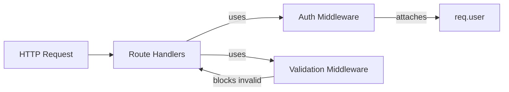
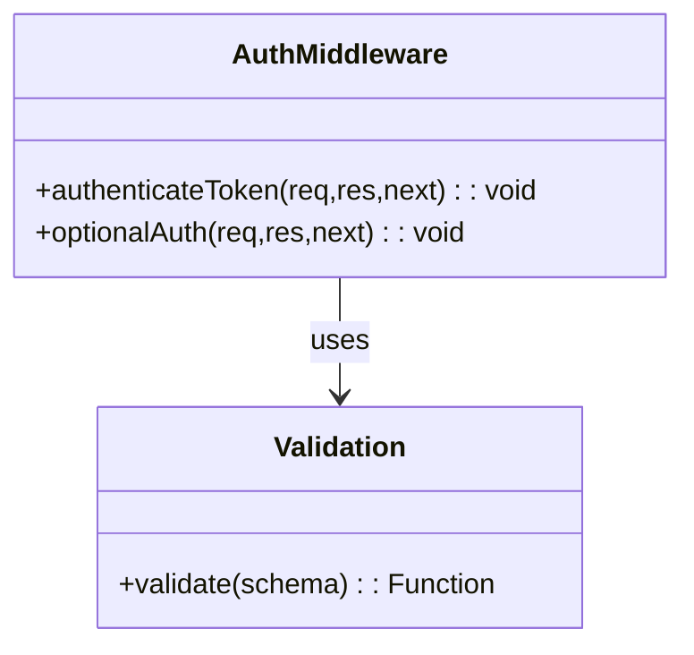

# Middleware (Support Layer)

## 1. Features

- Central auth token verification (`authenticateToken`) and optional auth (`optionalAuth`).
- Request validation hook points (used by `utils/validation.js`).
- Small, testable middleware pieces used by routes across the service.

---

## 2. Design & Internal architecture

Text description

Middleware is intentionally minimal: it performs orthogonal concerns (authentication, optional authentication, request validation) and attaches necessary context to `req` so route handlers remain focused on business logic.

Mermaid view

Design justification

- Keep middleware single-responsibility so it can be reused and unit-tested.
- Attach only IDs/claims to `req.user`, avoid loading full user objects in middleware to reduce DB coupling (services resolve full user objects where needed).

---

## 3. Data abstraction

- No persistent ADTs — middleware operates on HTTP request/response and on short-lived token claims (`{ id, username }`).

---

## 4. Stable storage

- Middleware itself does not store data. It relies on `config/database.js` and models/services for storage interactions.

---

## 5. External API (Integration points)

- `authenticateToken(req,res,next)` — rejects with 401 on missing/invalid token; attaches `req.user = { id }`.
- `optionalAuth(req,res,next)` — attaches `req.user` when present, otherwise `null`.
- Validation middleware invoked per-route via `validate(schema)` (see `utils/validation.js`).

---

## 6. Classes, methods, and fields (files)

`middleware/auth.js`
- `authenticateToken(req,res,next)`
- `optionalAuth(req,res,next)`

`utils/validation.js` (middleware factory)
- `validate(schema)` — returns an Express middleware that validates `req.body`/`req.params`/`req.query` via Joi.

Visibility notes: These modules are required by route files in `simple-server/routes/*.js` and should remain small and focused.

---

## 7. Module-internal class diagram

