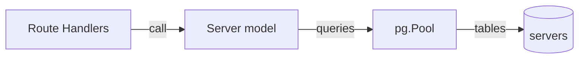
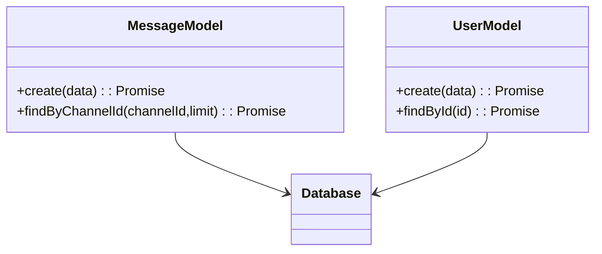

# Models (Data Access Layer)

## 1. Features

- Encapsulate SQL queries and data mapping for domain entities: `User`, `Server`, `Channel`, `Message`, `InviteCode`, `FriendRequests`, `DirectMessage`.
- Provide ADT-style interfaces (create/find/update/delete) consumed by services.

---

## 2. Design & Internal architecture

Text description

Models are thin DAOs that centralize SQL statements and translations between DB rows and domain objects. Business invariants are enforced at the model and service layers as appropriate.

Mermaid view

Design justification

- Centralizing SQL reduces duplication and makes it possible to tune queries independently of HTTP or service code.

---

## 3. Data abstraction

- Each model exposes promise-returning operations (CRUD + domain-specific helpers like `hasAccess`, `reorder`).

---

## 4. Stable storage

- All models use `pg.Pool` configured in `config/database.js`. Use transactions in model functions that perform multi-row updates.

---

## 5. External API (Model methods)

- `models/User.js`: `create`, `findByEmail`, `findById`, `updateProfile`
- `models/Server.js`: `create`, `findById`, `findByUserId`, `addMember`, `isMember`
- `models/Channel.js`: `create`, `findByServerId`, `reorder`
- `models/Message.js`: `create`, `findByChannelId`, `findByDmId`, `addReaction`

---

## 6. Classes, methods, and fields (files)

- `models/*.js` — each file exports the public DAO functions used by services; tests mock these during unit tests.

---

## 7. Module-internal class diagram

