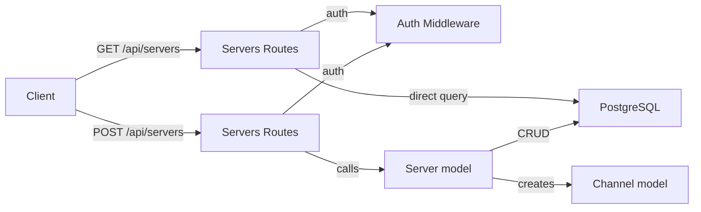
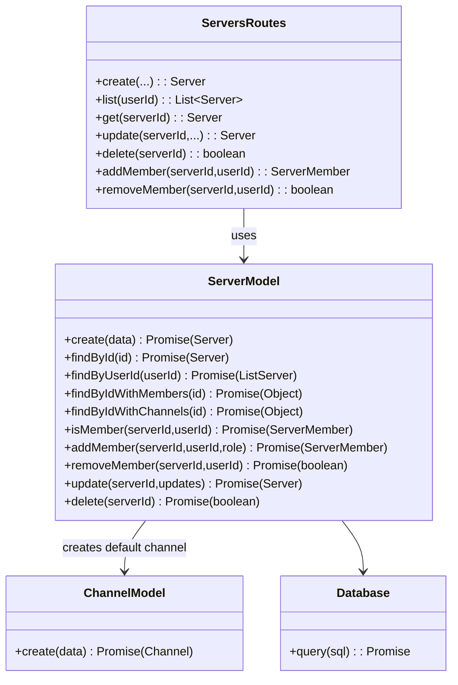

# Servers Module

## 1. Features

- Create a new server (owner becomes initial member and role). 
- List servers the authenticated user is a member of (with member IDs and member counts).
- Search servers by name (scoped to servers the user is a member of).
- Read a server's full details (members, channels) if the caller is a member.
- Update server metadata (name, icon) for owner/admin roles.
- Delete server (owner only).
- Add and remove members (owner/admin restrictions enforced).

Not included:
- Invite-code generation/management in docs (invite code functionality exists in code but per project doc policy we intentionally exclude invite-link documentation here).

---

## 2. Design & Internal architecture

Text description

The Servers module manages server lifecycle, membership, and associated channels. Key decisions:
- Route handlers are thin controllers that validate authorization and call server-level operations in the `Server` model.
- Membership checks are performed at the route boundary using `Server.isMember()` to gate access to private server resources.
- Write operations (create/update/delete/add/remove) are serialized at the DB level using transactions in model functions (where needed) to ensure consistency.
- Lightweight queries (search, list) use raw pooled SQL for efficient projection; richer reads (server with members and channels) compose model calls.
- Channel creation for a new server is performed at creation time to ensure a default communication channel exists.

Design justification (for senior architect)

- Keep business rules in model/service code so they can be unit-tested and reasoned about separately from HTTP semantics.
- Use explicit membership checks to centralize authorization logic, enabling clear audit and easier refactor to RBAC or permission layers later.
- Favor tuned SQL for read-heavy projections (search/list) while using model functions for compositional reads that combine multiple tables.
- Use PostgreSQL transactions to maintain invariants (owner exists, default channel created) on server creation and deletion.

Mermaid view



---

## 3. Data abstraction

Primary ADTs

- Server: { id, name, icon, owner_id, created_at, updated_at }
- ServerMember: { server_id, user_id, role } where `role ∈ {owner, admin, member}`
- Channel (light): { id, name, server_id, position }

Formal ADT operations

- `createServer(data) -> Server`
- `findById(serverId) -> Server | null`
- `findByIdWithMembers(serverId) -> { server, members[] }`
- `findByIdWithChannels(serverId) -> { server, channels[] }`
- `findByUserId(userId) -> [Server]` (returns servers where user is member)
- `addMember(serverId, userId, role='member') -> ServerMember`
- `removeMember(serverId, userId) -> boolean`
- `isMember(serverId, userId) -> ServerMember | null`
- `update(serverId, updates) -> Server`
- `delete(serverId) -> boolean`

Clients operate on these ADTs; representation details (rows, join queries) are hidden inside model functions.

---

## 4. Stable storage

- PostgreSQL (via `pg.Pool`) — used for durability and transactional correctness. Model functions use transactions for multi-step mutations.
- Ensure indices on `servers.name`, `server_members(server_id)`, and `server_members(user_id)` for search and membership lookups.

### 4a. Data schemas (SQL excerpts)

```sql
CREATE TABLE servers (
  id VARCHAR(255) PRIMARY KEY,
  name VARCHAR(255) NOT NULL,
  icon VARCHAR(500),
  owner_id VARCHAR(255) NOT NULL,
  created_at TIMESTAMP DEFAULT CURRENT_TIMESTAMP,
  updated_at TIMESTAMP DEFAULT CURRENT_TIMESTAMP
);

CREATE TABLE server_members (
  server_id VARCHAR(255) NOT NULL,
  user_id VARCHAR(255) NOT NULL,
  role VARCHAR(20) NOT NULL DEFAULT 'member',
  PRIMARY KEY (server_id, user_id),
  FOREIGN KEY (server_id) REFERENCES servers(id) ON DELETE CASCADE
);

CREATE TABLE channels (
  id VARCHAR(255) PRIMARY KEY,
  name VARCHAR(255) NOT NULL,
  server_id VARCHAR(255) NOT NULL,
  position INTEGER DEFAULT 0,
  FOREIGN KEY (server_id) REFERENCES servers(id) ON DELETE CASCADE
);

CREATE INDEX idx_servers_name ON servers(name);
CREATE INDEX idx_server_members_user ON server_members(user_id);
```

---

## 5. External API (REST)

All responses use `{ success: boolean, message?: string, data?: object }`.

- GET `/api/servers/search?q=<name>&limit=<n>`
  - Auth: required
  - Returns: `200 { success:true, data: { servers: [{ id,name,icon,owner_id,member_count,role,created_at }, ...] } }`
  - 400 if `q` missing

- POST `/api/servers`
  - Auth: required
  - Body: `{ name, icon? }`
  - Returns: `201 { success:true, data: { server } }`
  - Creates default `general` channel and adds owner as member

- GET `/api/servers`
  - Auth: required
  - Returns: `200 { success:true, data: { servers: [serverWithMembers...] } }`

- GET `/api/servers/:serverId`
  - Auth: required; caller must be a member
  - Returns: `200 { success:true, data: { server } }` including `members` and `channels`
  - 403 if not a member, 404 if missing

- PUT `/api/servers/:serverId`
  - Auth: required; only owner/admin can update
  - Body: `{ name?, icon? }`
  - Returns: `200 { success:true, data: { server } }`

- DELETE `/api/servers/:serverId`
  - Auth: required; owner only
  - Returns: `200 { success:true, message: 'Server deleted' }`

- POST `/api/servers/:serverId/members`
  - Auth: required; owner/admin only
  - Body: `{ userId }`
  - Returns: `201 { success:true, data: { member } }`

- DELETE `/api/servers/:serverId/members/:userId`
  - Auth: required; permission rules enforced (owner/admin)
  - Returns: `200 { success:true, message: 'Member removed' }`

Error semantics: `400` for validation, `401/403` for auth/permission, `404` for not found, `500` for server errors.

---

## 6. Classes, methods, and fields

`routes/server.js` (HTTP surface)
- `GET /search` — search servers where caller is a member
- `POST /` — create server and default channel
- `GET /` — list servers for user
- `GET /:serverId` — server details (members + channels)
- `PUT /:serverId` — update server
- `DELETE /:serverId` — delete server
- `POST /:serverId/members` — add member
- `DELETE /:serverId/members/:userId` — remove member

`models/Server.js` (data access / business rules)
- `create(data) -> Promise<Server>`
- `findById(serverId) -> Promise<Server|null>`
- `findByUserId(userId) -> Promise<[Server]>`
- `findByIdWithMembers(serverId) -> Promise<{server, members[]}>`
- `findByIdWithChannels(serverId) -> Promise<{server, channels[]}>`
- `isMember(serverId, userId) -> Promise<ServerMember|null>`
- `addMember(serverId, userId, role='member') -> Promise<ServerMember>`
- `removeMember(serverId, userId) -> Promise<boolean>`
- `update(serverId, updates) -> Promise<Server>`
- `delete(serverId) -> Promise<boolean>`

`models/Channel.js` (used at server creation)
- `create(data) -> Promise<Channel>`

Visibility notes
- Route handlers are the HTTP API; `Server` model functions provide the module's business API callable from other server-side modules (e.g., channel creation logic).

---

## 7. Module-internal class diagram



---

Notes for implementers
- Use transactions when creating a server + default channel + owner membership to avoid half-created state.
- Enforce permission checks using `Server.isMember()` consistently to avoid privilege escalation.

*File created: `docs/modules/servers.md`*
