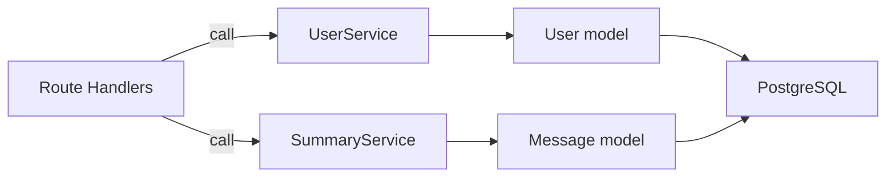
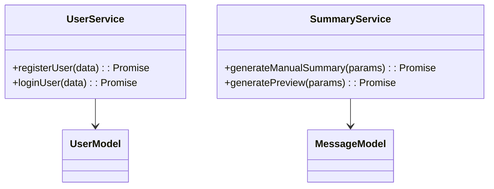

# Services (Support Layer)

## 1. Features

- Business-logic services implementing non-HTTP behavior: `userService`, `summaryService`, `seedData` helpers.
- Encapsulate rules like password hashing, token generation, message summarization, and demo-data seeding.

---

## 2. Design & Internal architecture

Text description

Services are the application's unit-testable business layer. Routes call services; services call models (DAOs) for storage and perform orchestration, transformations, and side-effecting operations.

Mermaid view

Design justification

- Keeps routes thin and focused on HTTP concerns.
- Allows mocking models during unit tests to validate business decisions in isolation.

---

## 3. Data abstraction

- Services accept simple input DTOs and return domain objects (e.g., `User`, `SummaryData`).

---

## 4. Stable storage

- Services rely on `models/*.js` which use `config/database.js` (`pg.Pool`) for SQL interactions.

---

## 5. External API (Calls used by routes)

- `userService.registerUser(userData) -> { user, token }`
- `userService.loginUser(loginData) -> { user, token }`
- `summaryService.generateManualSummary(params) -> SummaryData`
- `summaryService.generatePreview(params) -> PreviewData`
- `seedData.initializeDemoAccounts()` (dev-only)

---

## 6. Classes, methods, and fields (files)

`services/userService.js`
- `registerUser`, `loginUser`, `getUserById`, `initializeDemoAccounts`

`services/summaryService.js`
- `generateManualSummary`, `generatePreview`, internal helpers to fetch messages and call summarizers (mocked)

`services/seedData.js`
- helper to seed demo users/servers for local development

---

## 7. Module-internal class diagram

