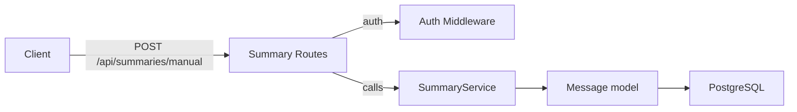
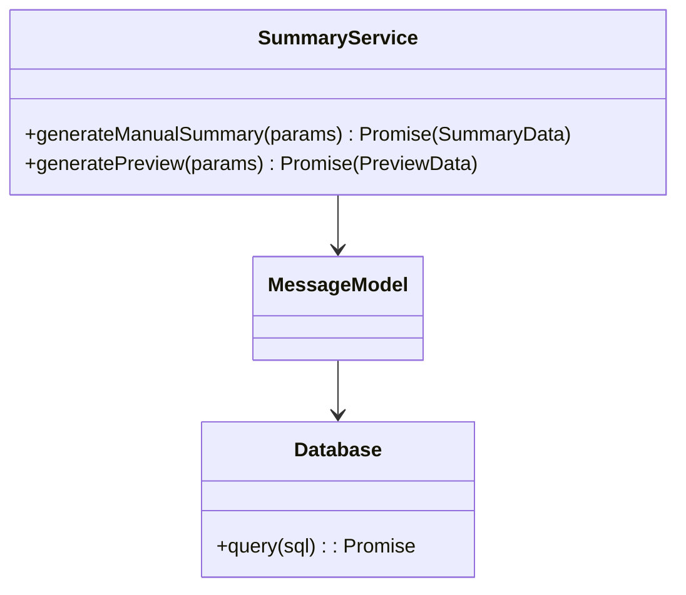

# Summary Module

## 1. Features

- Generate manual full summaries for a channel or DM (`/api/summaries/manual`).
- Generate lightweight "preview" summaries (`/api/summaries/preview`) for "what you missed" since a timestamp.

Not included:
- Automatic scheduled summary generation (if present elsewhere), or external LLM integration beyond the mocked SummaryService.

---

## 2. Design & Internal architecture

Text description

The Summary module delegates heavy work to `SummaryService`. Routes validate access (channel or DM participant checks), translate parameters (hours, maxMessages, since), and call service functions which fetch messages and produce summaries. The service abstracts message retrieval, summarization heuristics, and any external calls.

Design justification

- Keep controller responsibilities minimal: validate authorization and parameters, then call `SummaryService` so summarization logic is centralized and testable.
- Encapsulate summarization behavior to allow later replacement with a real LLM-backed implementation without changing routes.

Mermaid view

---

## 3. Data abstraction

Primary concepts

- Summary: { id?, type: 'manual'|'preview', generated_at, content, meta }

Operations

- `generateManualSummary({channelId, dmId, hours, maxMessages}) -> SummaryData`
- `generatePreview({channelId, dmId, since}) -> PreviewData`

---

## 4. Stable storage

- Summaries are produced on-demand and returned in responses; there is no persistent summaries table in the current codebase (service returns ephemeral summary objects). If persistence is desired, add a `summaries` table and persist outputs.

### 4a. Data schema

- None required for current implementation (ephemeral responses). If persisted, a `summaries` table with `id, type, target_id, content, created_at` would suffice.

---

## 5. External API (REST)

- POST `/api/summaries/manual` — body `{ channelId? | dmId?, hours?, maxMessages? }` — returns `{ summary }`.
- GET `/api/summaries/preview?channelId=...|dmId=...&since=...` — returns `{ preview }`.

Error semantics: 400 validation, 401/403 auth/permission, 500 service errors.

---

## 6. Classes, methods, and fields

`routes/summary.js` (HTTP surface)
- `POST /manual` — calls `SummaryService.generateManualSummary`
- `GET /preview` — calls `SummaryService.generatePreview`

`services/summaryService.js`
- `generateManualSummary(params) -> Promise<SummaryData>`
- `generatePreview(params) -> Promise<PreviewData>`
- Internal helpers: fetch messages, prune/normalize content, call summarizer (mocked)

Visibility: `SummaryService` is the primary API for summarization and may be used by background jobs or other services.

---

## 7. Module-internal class diagram

