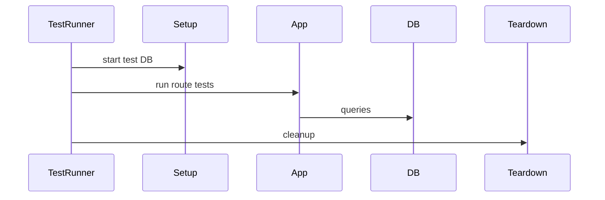

# Testing (Support Layer)

## 1. Features

- Jest-based tests under `simple-server/tests/` covering routes and services.
- Test setup utilities in `tests/setup.js` to initialize DB state and mock dependencies.

---

## 2. Design & Internal architecture

Text description

Tests are organized around unit and integration tests. Unit tests mock DB/models; integration tests use a test database (or a DB transaction rollback strategy in `setup.js`).

Mermaid view



Design justification

- Use Jest for fast iteration and snapshots where helpful; keep tests deterministic by seeding predictable data and cleaning up between runs.

---

## 3. Data abstraction

- Test fixtures and seed helpers provide deterministic row data for assertions.

---

## 4. Stable storage

- Integration tests use a test PostgreSQL instance configured via env vars (see `README_DATABASE.md`).

---

## 5. External API (Test commands)

Run tests:

```bash
npm test --prefix simple-server
```

---

## 6. Files and methods

- `simple-server/tests/*.test.js` — route and service tests
- `simple-server/tests/setup.js` — setup/teardown for DB and test environment

---

## 7. Diagram (test flow)


