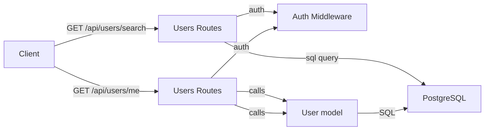
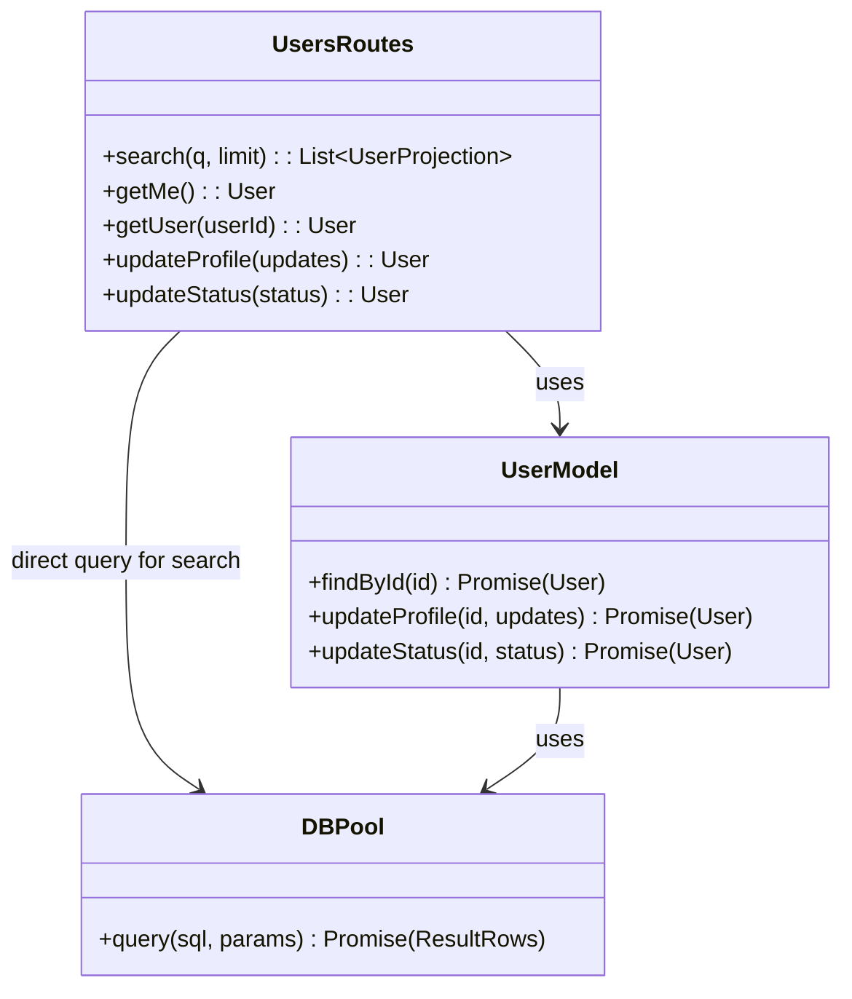

# Users Module

## 1. Features

- Search users by username (paginated/limited results).
- Read authenticated user's full profile (`/api/users/me`).
- Read any user's public profile (`/api/users/:userId`).
- Update authenticated user's profile fields (display name, avatar).
- Update authenticated user's online status (`online`, `idle`, `dnd`, `offline`).

Not included:
- Account creation / password handling (handled by `auth` module).
- Friend management (handled in `friends` routes).

---

## 2. Design & Internal architecture

Text description

The Users module focuses on profile read/update and search. Implementation choices are pragmatic:
- Route handlers are thin controllers that validate inputs, call into data-access functions, and respond with consistent JSON shapes.
- Profile updates and reads use the `User` model abstraction to encapsulate SQL and mapping logic.
- The search endpoint performs a targeted SQL query via the shared `pg` pool for efficient ILIKE search and simple projection (no heavy object materialization).
- `authenticateToken` middleware protects all endpoints that require identity; public user profiles still require a caller (the app expects authenticated access for user lookups).

Design justification

- Small surface area: keeping logic in models/DAOs reduces duplication and keeps route handlers readable.
- Direct SQL for search: search is read-heavy and limited; issuing a focused query to the pool keeps latency low and allows tuning (indexes) without extra abstraction layers.
- Reuse `User` model for business invariants (e.g., normalization of display fields) so higher-level callers don't reimplement them.

Mermaid view



---

## 3. Data abstraction

Primary abstraction:
- User (entity): { id, username, display_name, avatar, status, created_at, updated_at }

Formal ADT view

- `findById(id) -> User | null`
- `updateProfile(id, updates) -> User`
- `updateStatus(id, status) -> User`
- The search operation returns a list of lightweight projections: `{ id, username, display_name, avatar, status }`.

Clients should treat the `User` ADT as the only interface to user storage; representation details (column names, SQL) are hidden.

---

## 4. Stable storage

- PostgreSQL (via `pg.Pool`) — durable storage for users. The `search` endpoint issues direct pooled queries; the model functions use SQL + the pool.
- Ensure appropriate indexes exist (e.g., on `username` for `ILIKE` searches).

### 4a. Data schema (relevant excerpt)

```sql
-- users table (see global DB schema)
CREATE TABLE users (
  id VARCHAR(255) PRIMARY KEY,
  username VARCHAR(50) UNIQUE NOT NULL,
  display_name VARCHAR(50),
  avatar VARCHAR(500),
  status VARCHAR(20) DEFAULT 'offline',
  created_at TIMESTAMP DEFAULT CURRENT_TIMESTAMP,
  updated_at TIMESTAMP DEFAULT CURRENT_TIMESTAMP
);

-- suggested index for search
CREATE INDEX idx_users_username ON users(username);
```

---

## 5. External API (REST)

Responses use `{ success: boolean, message?: string, data?: object }`.

- GET `/api/users/search?q=<username>&limit=<n>`
  - Auth: required (`authenticateToken`)
  - Query: `q` required
  - Returns: `200 { success:true, data: { users: [{ id, username, display_name, avatar, status }, ...] } }`
  - Errors: `400` when `q` missing, `500` on server error.

- GET `/api/users/me`
  - Auth: required
  - Returns: `200 { success:true, data: { user } }` (full profile)
  - Errors: `404` if user not found, `500` on server error.

- PUT `/api/users/me/profile`
  - Auth: required
  - Body: `{ displayName?, avatar? }` (at least one required)
  - Returns: `200 { success:true, data: { user } }` updated profile
  - Errors: `400` if nothing to update or validation fails, `400/500` on DB errors.

- PUT `/api/users/me/status`
  - Auth: required
  - Body: `{ status }` where `status ∈ {online, idle, dnd, offline}`
  - Returns: `200 { success:true, data: { user } }`
  - Errors: `400` if invalid status, `500` on server error.

- GET `/api/users/:userId`
  - Auth: required
  - Returns: `200 { success:true, data: { user } }` public profile
  - Errors: `404` if not found, `500` on server error.

---

## 6. Classes, methods, and fields

`routes/users.js` (HTTP surface)
- `GET /search` — protected; uses `pool.query` to return projections.
- `GET /me` — protected; calls `User.findById(req.user.id)`.
- `PUT /me/profile` — protected; calls `User.updateProfile(req.user.id, updates)`.
- `PUT /me/status` — protected; calls `User.updateStatus(req.user.id, status)`.
- `GET /:userId` — protected; calls `User.findById(userId)`.

`models/User.js` (data access)
- `findById(id) -> Promise<User|null>` — public to module.
- `updateProfile(id, updates) -> Promise<User>` — updates display fields.
- `updateStatus(id, status) -> Promise<User>` — updates status.

Visibility
- Route handlers are the web-facing surface.
- `User` model functions are internal module DAOs; they are used by routes but not directly exposed over HTTP beyond the route handlers.

---

## 7. Module-internal class diagram



---

Notes
- Keep validation strict on `PUT /me/*` endpoints to avoid unexpected DB writes.
- Prefer using `User` model functions for behavior that must be unit-tested; use direct pool queries only for simple read-only projections that benefit from finely tuned SQL.

*File created: `docs/modules/users.md`*
