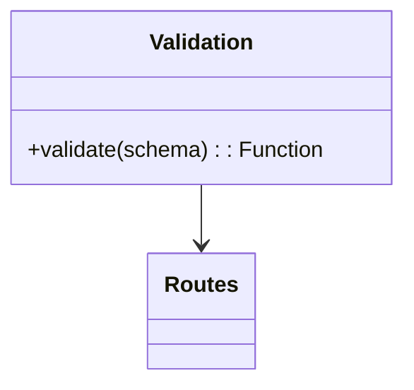

# Utils (Support Layer)

## 1. Features

- Small re-usable helpers: request validation (`utils/validation.js`), general helpers used by services/tests.

---

## 2. Design & Internal architecture

Text description

Mermaid view

Utilities provide composable helpers that reduce duplication: the Joi-based `validate` factory, common ID generators, and any small pure helpers used across modules.

Design justification

- Keep utilities well-named and limited in scope to avoid uncontrolled coupling across modules.

---

## 3. Data abstraction

- No DB; utilities operate on in-memory inputs and return plain values or middleware functions.

---

## 4. Stable storage

- None.

---

## 5. External API (Exports)

- `validate(schema)` — returns Express middleware using Joi schemas located in route definitions.

---

## 6. Files and methods

- `utils/validation.js` — Joi schemas + `validate` helper

---

## 7. Diagram

